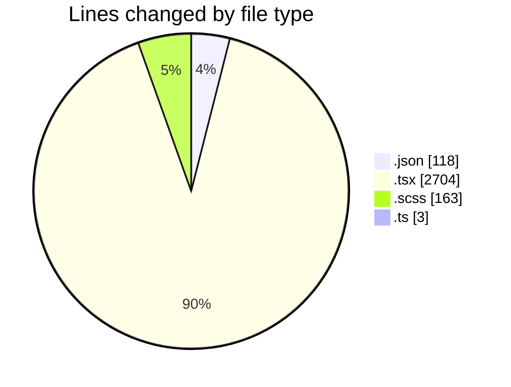
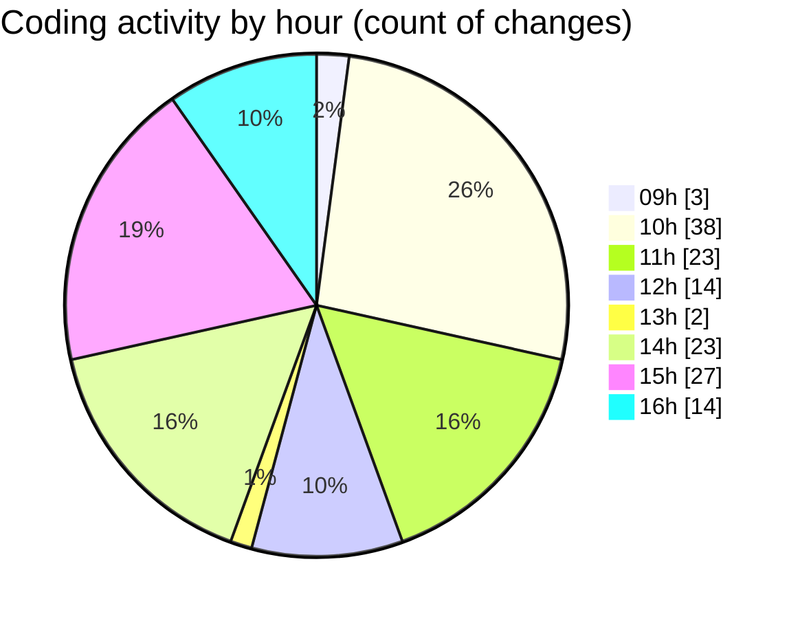

# cda - Activity Summary 

## Overall Statistics

| Stat                   | Value                                                             |
| ---------------------- | ----------------------------------------------------------------- |
| **Lines Added** (➕)   | 2580                                          |
| **Lines Removed** (➖) | 408                                        |
| **Net Change** (↕)    | 2172                |
| **Active Time** (⌚)   | 249 minutes |

## Modified Files
- **settings.json** (+118, -0)
- **EventForm.tsx** (+1576, -359)
- **EventForm.scss** (+163, -0)
- **PublishEvent.tsx** (+85, -47)
- **EventPage.tsx** (+491, -2)
- **index.ts** (+3, -0)
- **PublishEvent.test.tsx** (+72, -0)
- **EventSubmitMode.test.tsx** (+72, -0)

## Visualizations

### By File Type (Lines Changed)

### By Hour (Estimated Activity Count)

> **Last Updated:** 19/11/2025, 16:11:33