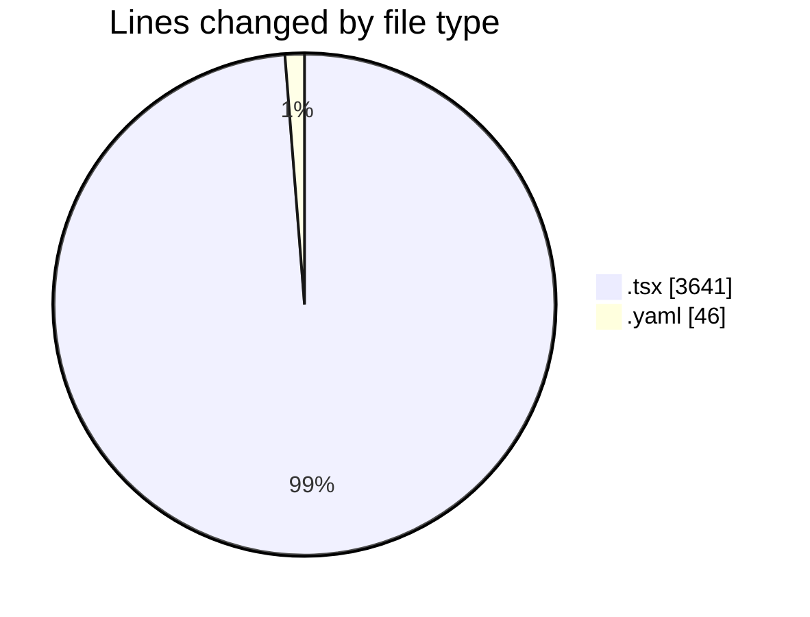
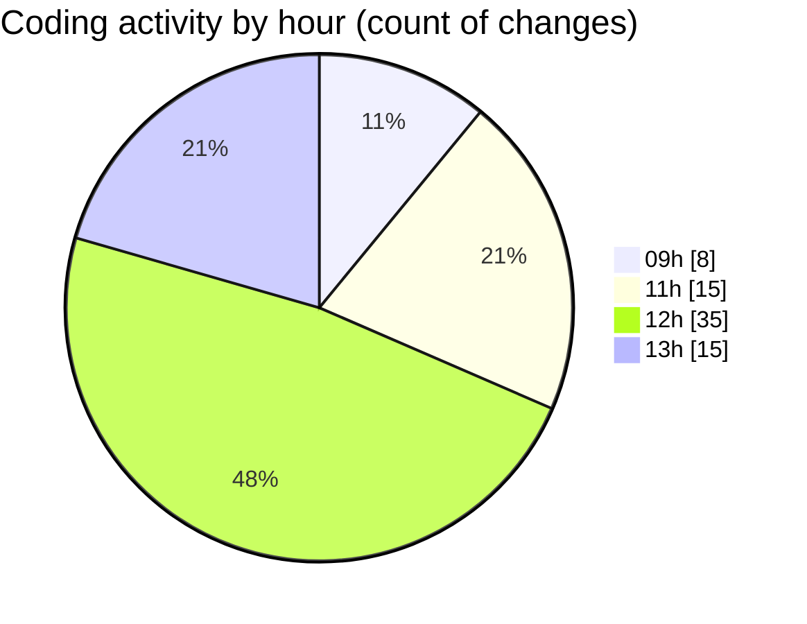

# cda - Activity Summary 

## Overall Statistics

| Stat                   | Value                                                             |
| ---------------------- | ----------------------------------------------------------------- |
| **Lines Added** (➕)   | 3568                                          |
| **Lines Removed** (➖) | 119                                        |
| **Net Change** (↕)    | 3449                |
| **Active Time** (⌚)   | 95 minutes |

## Modified Files
- **EventForm.tsx** (+18, -43)
- **EventForm.test.tsx** (+1944, -1)
- **EventSubmitMode.tsx** (+40, -0)
- **EventSubmitMode.test.tsx** (+128, -36)
- **config.yaml** (+38, -8)
- **DuplicateEventWrapper.tsx** (+29, -0)
- **DeleteEventWrapper.tsx** (+56, -0)
- **EventModal.tsx** (+78, -5)
- **EventPage.tsx** (+506, -13)
- **Register.tsx** (+154, -0)
- **CapacityBadge.tsx** (+82, -7)
- **EventCard.tsx** (+224, -6)
- **Register.test.tsx** (+271, -0)

## Visualizations

### By File Type (Lines Changed)

### By Hour (Estimated Activity Count)

> **Last Updated:** 20/11/2025, 13:28:59