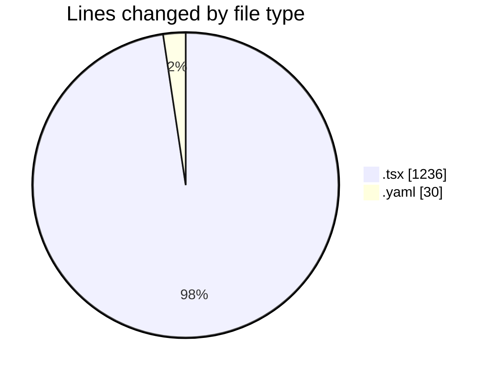
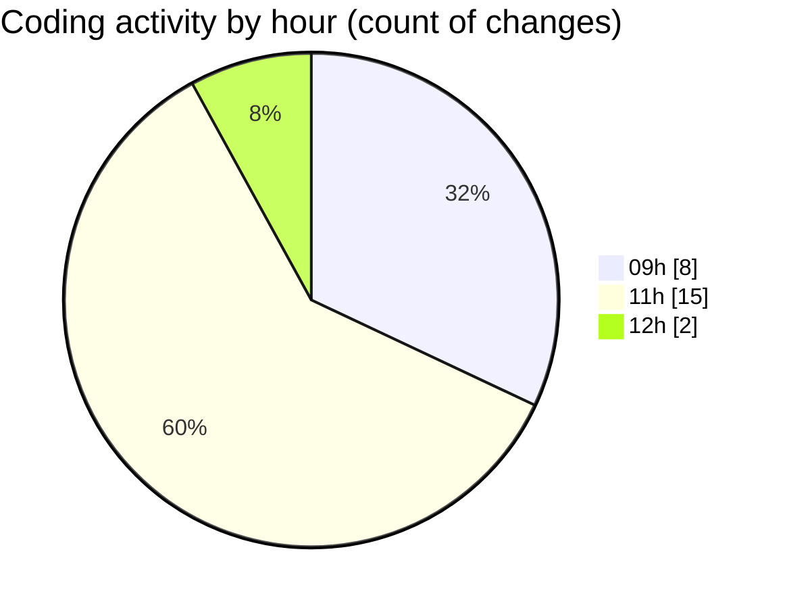

# cda - Activity Summary 

## Overall Statistics

| Stat                   | Value                                                             |
| ---------------------- | ----------------------------------------------------------------- |
| **Lines Added** (➕)   | 1187                                          |
| **Lines Removed** (➖) | 79                                        |
| **Net Change** (↕)    | 1108                |
| **Active Time** (⌚)   | 33 minutes |

## Modified Files
- **EventForm.tsx** (+18, -43)
- **EventForm.test.tsx** (+971, -0)
- **EventSubmitMode.tsx** (+40, -0)
- **EventSubmitMode.test.tsx** (+128, -36)
- **config.yaml** (+30, -0)

## Visualizations

### By File Type (Lines Changed)

### By Hour (Estimated Activity Count)

> **Last Updated:** 20/11/2025, 12:08:58