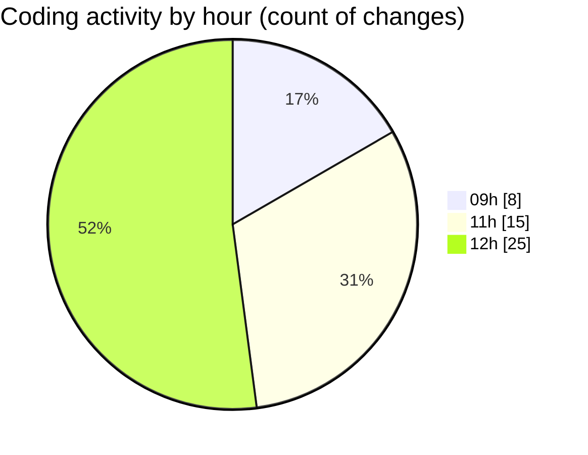

# cda - Activity Summary 

## Overall Statistics

| Stat                   | Value                                                             |
| ---------------------- | ----------------------------------------------------------------- |
| **Lines Added** (➕)   | 2075                                          |
| **Lines Removed** (➖) | 89                                        |
| **Net Change** (↕)    | 1986                |
| **Active Time** (⌚)   | 64 minutes |

## Modified Files
- **EventForm.tsx** (+18, -43)
- **EventForm.test.tsx** (+971, -0)
- **EventSubmitMode.tsx** (+40, -0)
- **EventSubmitMode.test.tsx** (+128, -36)
- **config.yaml** (+38, -8)
- **DuplicateEventWrapper.tsx** (+29, -0)
- **DeleteEventWrapper.tsx** (+56, -0)
- **EventModal.tsx** (+73, -0)
- **EventPage.tsx** (+491, -0)
- **Register.tsx** (+153, -0)
- **CapacityBadge.tsx** (+78, -2)

## Visualizations

### By File Type (Lines Changed)

### By Hour (Estimated Activity Count)

> **Last Updated:** 20/11/2025, 12:43:58