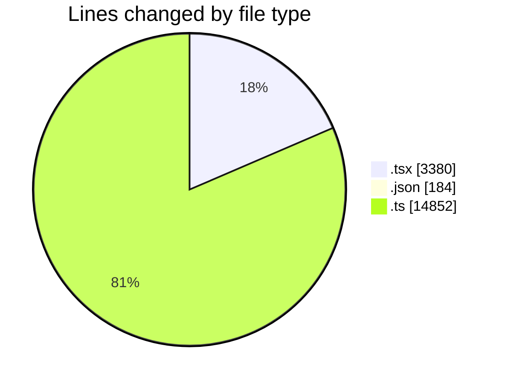
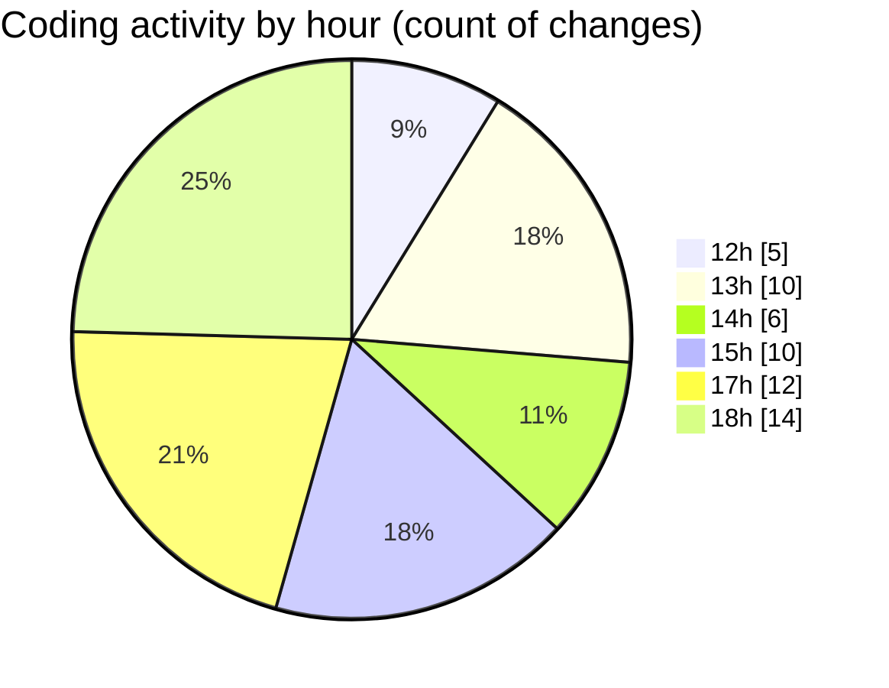

# cda - Activity Summary 

## Overall Statistics

| Stat                   | Value                                                             |
| ---------------------- | ----------------------------------------------------------------- |
| **Lines Added** (➕)   | 18263                                          |
| **Lines Removed** (➖) | 153                                        |
| **Net Change** (↕)    | 18110                |
| **Active Time** (⌚)   | 73 minutes |

## Modified Files
- **EventForm.tsx** (+1254, -45)
- **EventForm.test.tsx** (+1020, -47)
- **DatetimeInput.tsx** (+152, -0)
- **DatetimeInput.stories.tsx** (+255, -11)
- **package.json** (+184, -0)
- **Home.tsx** (+256, -39)
- **calendar.ts** (+1067, -0)
- **buildEventQueryVariables.ts** (+52, -7)
- **index.ts** (+207, -1)
- **graphql.ts** (+7342, -0)
- **gql.ts** (+196, -0)
- **gql.ts** (+46, -0)
- **graphql.ts** (+5934, -0)
- **EventCard.tsx** (+221, -2)
- **CapacityBadge.tsx** (+77, -1)

## Visualizations

### By File Type (Lines Changed)

### By Hour (Estimated Activity Count)

> **Last Updated:** 21/11/2025, 18:22:00