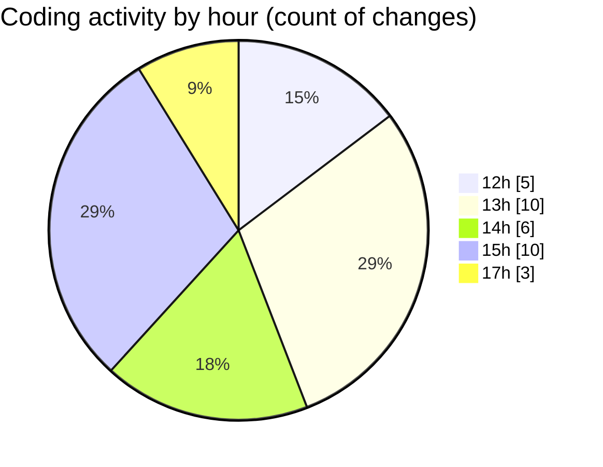

# cda - Activity Summary 

## Overall Statistics

| Stat                   | Value                                                             |
| ---------------------- | ----------------------------------------------------------------- |
| **Lines Added** (➕)   | 4219                                          |
| **Lines Removed** (➖) | 120                                        |
| **Net Change** (↕)    | 4099                |
| **Active Time** (⌚)   | 41 minutes |

## Modified Files
- **EventForm.tsx** (+1254, -45)
- **EventForm.test.tsx** (+1020, -47)
- **DatetimeInput.tsx** (+152, -0)
- **DatetimeInput.stories.tsx** (+255, -11)
- **package.json** (+184, -0)
- **Home.tsx** (+235, -17)
- **calendar.ts** (+1067, -0)
- **buildEventQueryVariables.ts** (+52, -0)

## Visualizations

### By File Type (Lines Changed)

### By Hour (Estimated Activity Count)

> **Last Updated:** 21/11/2025, 17:42:00