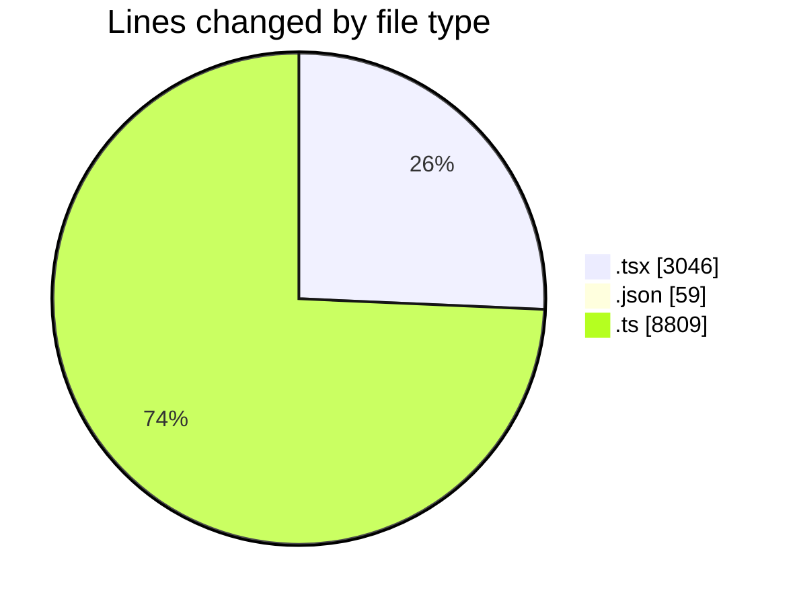
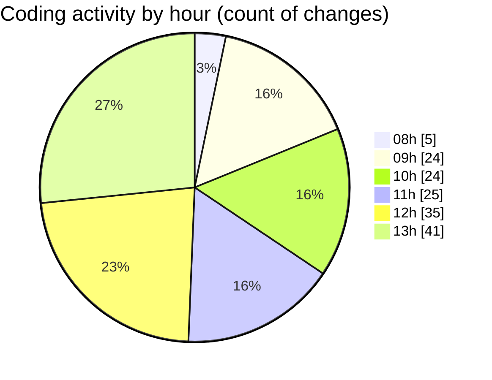

# cda - Activity Summary 

## Overall Statistics

| Stat                   | Value                                                             |
| ---------------------- | ----------------------------------------------------------------- |
| **Lines Added** (➕)   | 11402                                          |
| **Lines Removed** (➖) | 512                                        |
| **Net Change** (↕)    | 10890                |
| **Active Time** (⌚)   | 234 minutes |

## Modified Files
- **Home.tsx** (+494, -37)
- **settings.json** (+59, -0)
- **ShowPastEventsToggle.tsx** (+30, -4)
- **index.ts** (+4, -0)
- **buildEventQueryVariables.ts** (+102, -34)
- **buildEventQueryVariables.test.ts** (+266, -170)
- **Register.tsx** (+308, -0)
- **EventCard.tsx** (+440, -3)
- **Home.test.tsx** (+596, -71)
- **index.ts** (+206, -0)
- **MyEvents.tsx** (+336, -193)
- **EventsList.tsx** (+54, -0)
- **graphql.ts** (+8027, -0)
- **EventPage.tsx** (+480, -0)

## Visualizations

### By File Type (Lines Changed)

### By Hour (Estimated Activity Count)

> **Last Updated:** 24/11/2025, 13:51:58