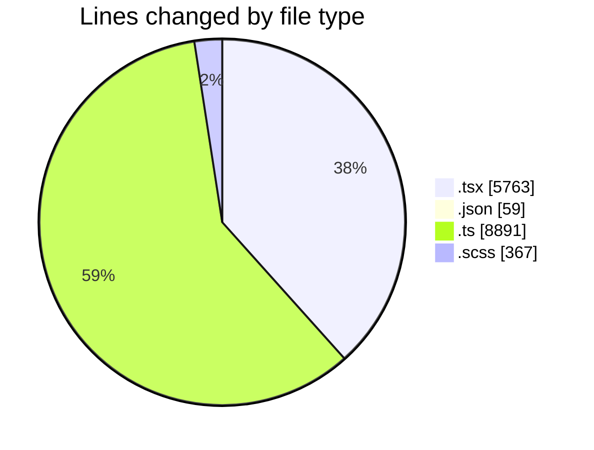
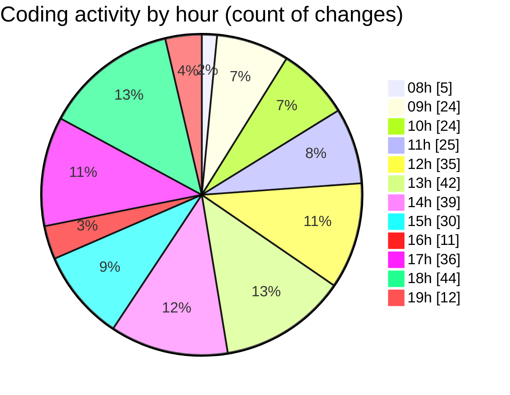

# cda - Activity Summary 

## Overall Statistics

| Stat                   | Value                                                             |
| ---------------------- | ----------------------------------------------------------------- |
| **Lines Added** (➕)   | 13870                                          |
| **Lines Removed** (➖) | 1210                                        |
| **Net Change** (↕)    | 12660                |
| **Active Time** (⌚)   | 496 minutes |

## Modified Files
- **Home.tsx** (+1301, -312)
- **settings.json** (+59, -0)
- **ShowPastEventsToggle.tsx** (+30, -4)
- **index.ts** (+4, -0)
- **buildEventQueryVariables.ts** (+102, -34)
- **buildEventQueryVariables.test.ts** (+266, -170)
- **Register.tsx** (+317, -8)
- **EventCard.tsx** (+470, -34)
- **Home.test.tsx** (+596, -71)
- **index.ts** (+206, -0)
- **MyEvents.tsx** (+1117, -540)
- **EventsList.tsx** (+63, -9)
- **graphql.ts** (+8027, -0)
- **EventPage.tsx** (+485, -4)
- **Register.test.tsx** (+271, -0)
- **EventCard.scss** (+349, -18)
- **splitEventsByDate.ts** (+36, -5)
- **refetchEvents.ts** (+41, -0)
- **SearchHeadingText.tsx** (+130, -1)

## Visualizations

### By File Type (Lines Changed)

### By Hour (Estimated Activity Count)

> **Last Updated:** 24/11/2025, 19:19:04