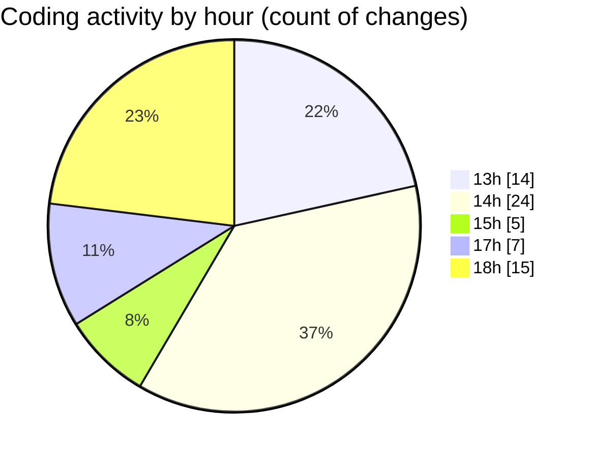

# cda - Activity Summary 

## Overall Statistics

| Stat                   | Value                                                             |
| ---------------------- | ----------------------------------------------------------------- |
| **Lines Added** (➕)   | 12422                                          |
| **Lines Removed** (➖) | 360                                        |
| **Net Change** (↕)    | 12062                |
| **Active Time** (⌚)   | 82 minutes |

## Modified Files
- **Home.tsx** (+450, -233)
- **calendar.ts** (+1192, -94)
- **MyEvents.test.tsx** (+163, -1)
- **EventsList.tsx** (+53, -0)
- **resolvers-types.ts** (+10088, -0)
- **calendar.js** (+366, -32)
- **events.ts** (+110, -0)

## Visualizations

### By File Type (Lines Changed)

### By Hour (Estimated Activity Count)

> **Last Updated:** 26/11/2025, 18:33:47