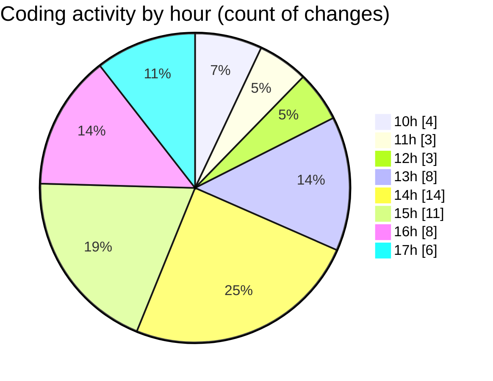

# cda - Activity Summary 

## Overall Statistics

| Stat                   | Value                                                             |
| ---------------------- | ----------------------------------------------------------------- |
| **Lines Added** (➕)   | 29875                                          |
| **Lines Removed** (➖) | 341                                        |
| **Net Change** (↕)    | 29534                |
| **Active Time** (⌚)   | 57 minutes |

## Modified Files
- **calendar.ts** (+3365, -47)
- **MyEvents.tsx** (+318, -191)
- **calendar-queries.ts** (+3426, -8)
- **events.ts** (+298, -25)
- **events.test.ts** (+212, -0)
- **package.json** (+17, -1)
- **package.json** (+67, -4)
- **skill-queries.ts** (+60, -1)
- **.env** (+50, -0)
- **skills.ts** (+300, -64)
- **clear_view_views.ts** (+3710, -0)
- **resolvers-types.ts** (+10103, -0)
- **calendar.js** (+346, -0)
- **yarn.lock** (+7603, -0)

## Visualizations

### By File Type (Lines Changed)

### By Hour (Estimated Activity Count)

> **Last Updated:** 28/11/2025, 17:24:10