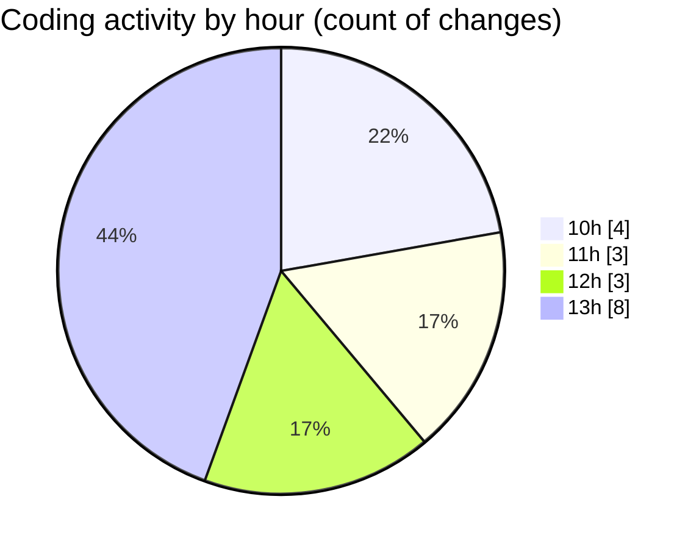

# cda - Activity Summary 

## Overall Statistics

| Stat                   | Value                                                             |
| ---------------------- | ----------------------------------------------------------------- |
| **Lines Added** (➕)   | 6619                                          |
| **Lines Removed** (➖) | 193                                        |
| **Net Change** (↕)    | 6426                |
| **Active Time** (⌚)   | 13 minutes |

## Modified Files
- **calendar.ts** (+2216, -0)
- **MyEvents.tsx** (+318, -191)
- **calendar-queries.ts** (+3411, -0)
- **events.ts** (+135, -0)
- **events.test.ts** (+106, -0)
- **package.json** (+17, -1)
- **package.json** (+66, -0)
- **skill-queries.ts** (+60, -1)
- **.env** (+50, -0)
- **skills.ts** (+240, -0)

## Visualizations

### By File Type (Lines Changed)

### By Hour (Estimated Activity Count)

> **Last Updated:** 28/11/2025, 13:49:10