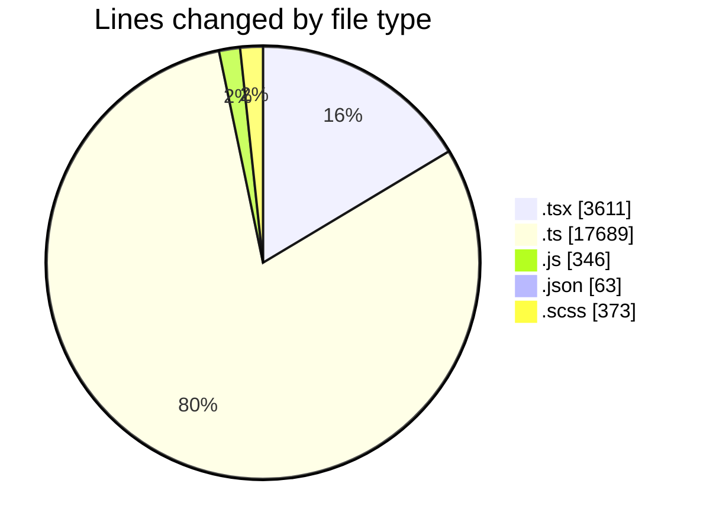
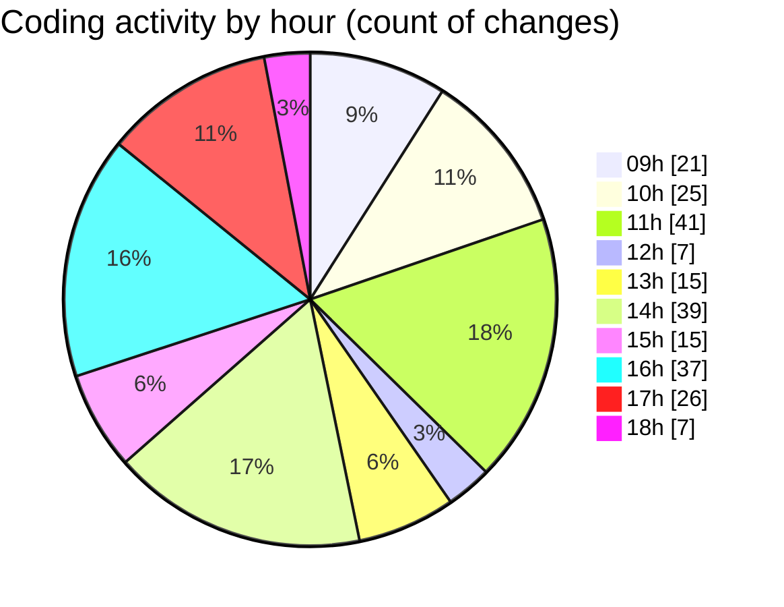

# cda - Activity Summary 

## Overall Statistics

| Stat                   | Value                                                             |
| ---------------------- | ----------------------------------------------------------------- |
| **Lines Added** (➕)   | 21453                                          |
| **Lines Removed** (➖) | 629                                        |
| **Net Change** (↕)    | 20824                |
| **Active Time** (⌚)   | 371 minutes |

## Modified Files
- **MyEvents.tsx** (+1572, -499)
- **calendar-queries.ts** (+1709, -0)
- **calendar.ts** (+1102, -0)
- **skills.ts** (+236, -0)
- **events.ts** (+276, -0)
- **calendar.js** (+346, -0)
- **package.json** (+63, -0)
- **events.test.ts** (+95, -0)
- **config.ts** (+38, -2)
- **Home.tsx** (+1002, -45)
- **EventsList.tsx** (+108, -0)
- **EventCard.tsx** (+218, -0)
- **EventCard.scss** (+361, -12)
- **index.ts** (+440, -0)
- **graphql.ts** (+7342, -0)
- **gql.ts** (+196, -0)
- **graphql.ts** (+5972, -0)
- **Register.tsx** (+164, -3)
- **useEventQuery.ts** (+170, -63)
- **usePaginatedEvents.ts** (+43, -5)

## Visualizations

### By File Type (Lines Changed)

### By Hour (Estimated Activity Count)

> **Last Updated:** 01/12/2025, 18:12:54