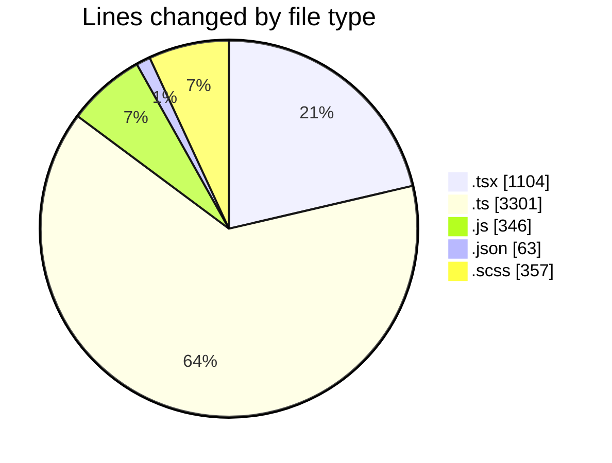
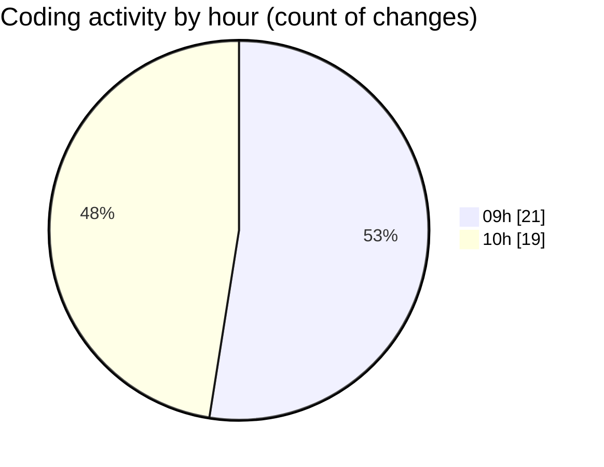

# cda - Activity Summary 

## Overall Statistics

| Stat                   | Value                                                             |
| ---------------------- | ----------------------------------------------------------------- |
| **Lines Added** (➕)   | 5161                                          |
| **Lines Removed** (➖) | 10                                        |
| **Net Change** (↕)    | 5151                |
| **Active Time** (⌚)   | 61 minutes |

## Modified Files
- **MyEvents.tsx** (+184, -0)
- **calendar-queries.ts** (+1709, -0)
- **calendar.ts** (+1102, -0)
- **skills.ts** (+236, -0)
- **events.ts** (+138, -0)
- **calendar.js** (+346, -0)
- **package.json** (+63, -0)
- **events.test.ts** (+95, -0)
- **config.ts** (+19, -2)
- **Home.tsx** (+647, -1)
- **EventsList.tsx** (+54, -0)
- **EventCard.tsx** (+218, -0)
- **EventCard.scss** (+350, -7)

## Visualizations

### By File Type (Lines Changed)

### By Hour (Estimated Activity Count)

> **Last Updated:** 01/12/2025, 10:42:13