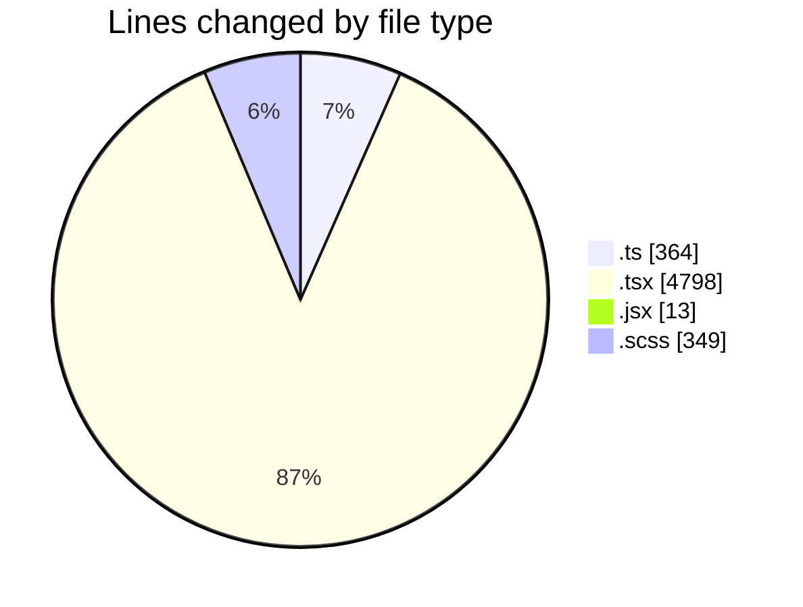
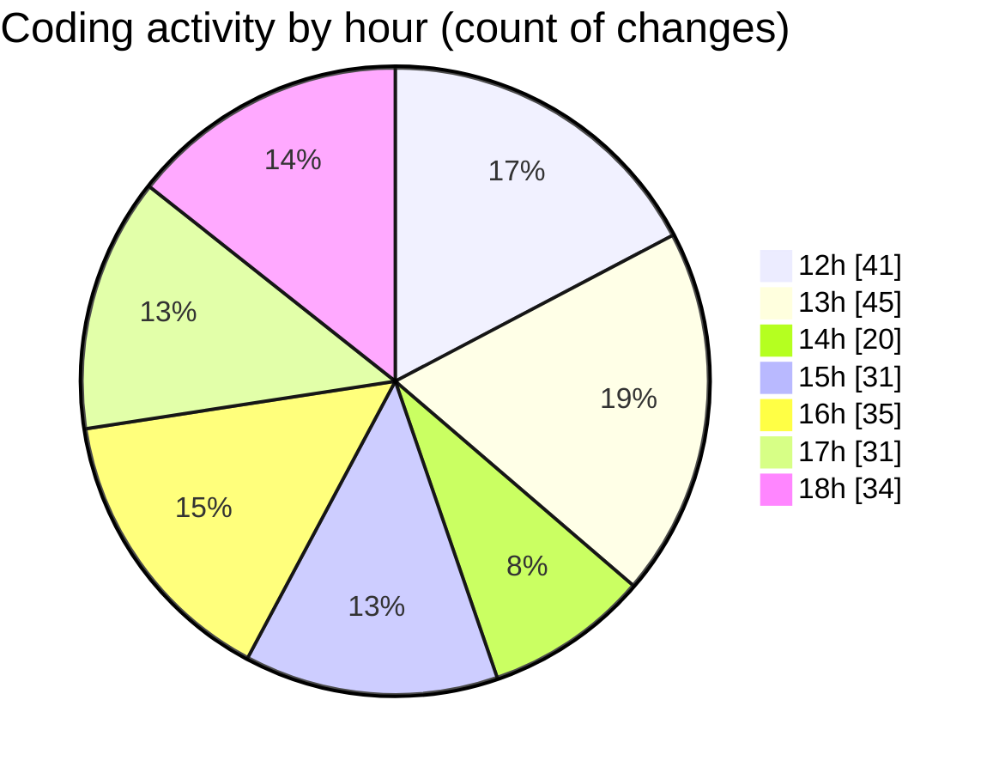

# cda - Activity Summary 

## Overall Statistics

| Stat                   | Value                                                             |
| ---------------------- | ----------------------------------------------------------------- |
| **Lines Added** (➕)   | 4776                                          |
| **Lines Removed** (➖) | 748                                        |
| **Net Change** (↕)    | 4028                |
| **Active Time** (⌚)   | 341 minutes |

## Modified Files
- **useEventQuery.ts** (+113, -27)
- **usePaginatedEvents.ts** (+33, -2)
- **MyEvents.tsx** (+457, -16)
- **useEventQuery.test.tsx** (+470, -256)
- **ScrollToTop.jsx** (+13, -0)
- **EventPage.tsx** (+482, -1)
- **refetchEvents.ts** (+50, -1)
- **Home.tsx** (+317, -0)
- **Home.test.tsx** (+1154, -50)
- **Register.test.tsx** (+275, -0)
- **MyEvents.test.tsx** (+764, -394)
- **EventCard.scss** (+349, -0)
- **Register.tsx** (+161, -1)
- **events.ts** (+138, -0)

## Visualizations

### By File Type (Lines Changed)

### By Hour (Estimated Activity Count)

> **Last Updated:** 02/12/2025, 19:02:43