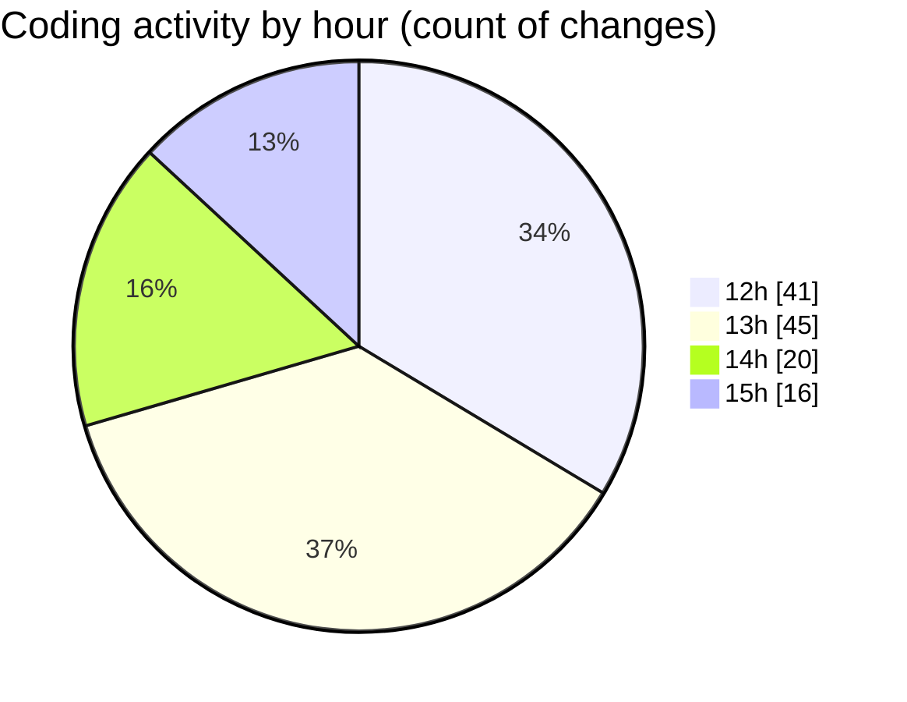

# cda - Activity Summary 

## Overall Statistics

| Stat                   | Value                                                             |
| ---------------------- | ----------------------------------------------------------------- |
| **Lines Added** (➕)   | 2781                                          |
| **Lines Removed** (➖) | 350                                        |
| **Net Change** (↕)    | 2431                |
| **Active Time** (⌚)   | 178 minutes |

## Modified Files
- **useEventQuery.ts** (+113, -27)
- **usePaginatedEvents.ts** (+33, -2)
- **MyEvents.tsx** (+213, -3)
- **useEventQuery.test.tsx** (+470, -256)
- **ScrollToTop.jsx** (+13, -0)
- **EventPage.tsx** (+482, -1)
- **refetchEvents.ts** (+50, -1)
- **Home.tsx** (+317, -0)
- **Home.test.tsx** (+602, -50)
- **Register.test.tsx** (+275, -0)
- **MyEvents.test.tsx** (+213, -10)

## Visualizations

### By File Type (Lines Changed)

### By Hour (Estimated Activity Count)

> **Last Updated:** 02/12/2025, 15:31:57