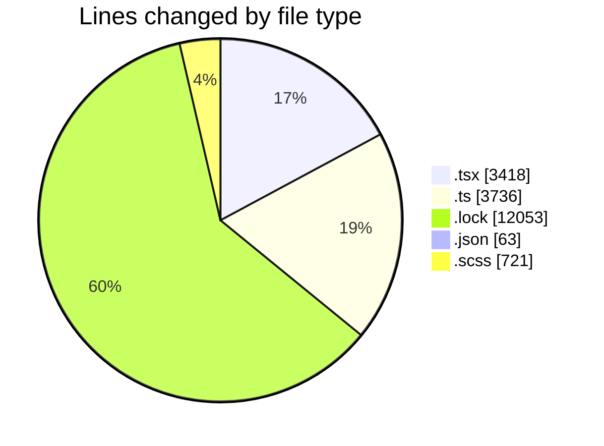
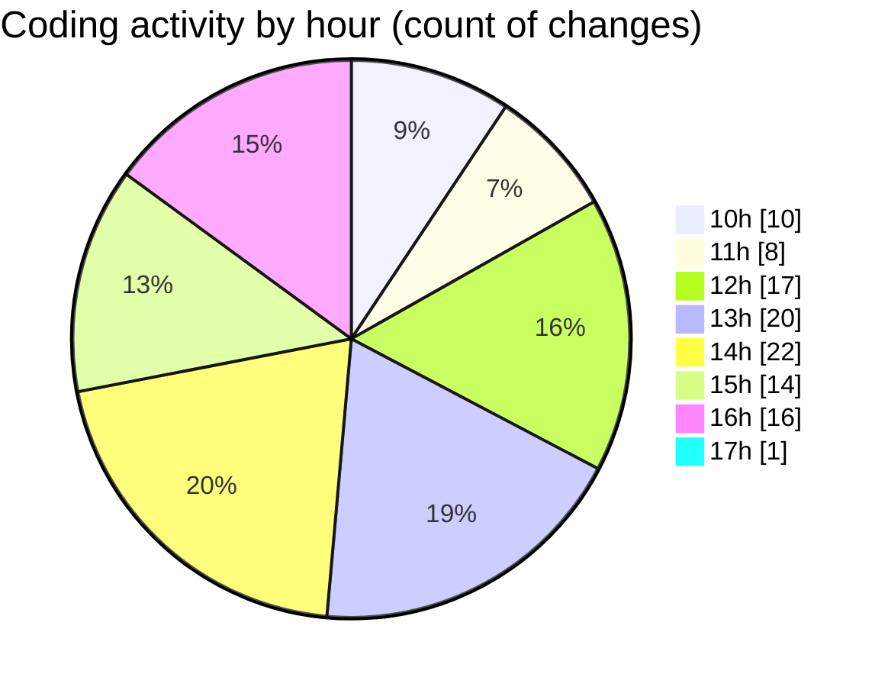

# cda - Activity Summary 

## Overall Statistics

| Stat                   | Value                                                             |
| ---------------------- | ----------------------------------------------------------------- |
| **Lines Added** (➕)   | 17324                                          |
| **Lines Removed** (➖) | 2667                                        |
| **Net Change** (↕)    | 14657                |
| **Active Time** (⌚)   | 135 minutes |

## Modified Files
- **Home.tsx** (+1142, -271)
- **calendar-queries.ts** (+3404, -0)
- **yarn.lock** (+9828, -2225)
- **package.json** (+63, -0)
- **events.ts** (+304, -28)
- **EventCard.scss** (+655, -2)
- **MyEvents.tsx** (+348, -0)
- **Register.tsx** (+316, -0)
- **Register.test.tsx** (+277, -0)
- **SearchHeadingText.tsx** (+130, -1)
- **EventsList.tsx** (+241, -140)
- **Home.test.tsx** (+552, -0)
- **EventsList.scss** (+64, -0)

## Visualizations

### By File Type (Lines Changed)

### By Hour (Estimated Activity Count)

> **Last Updated:** 03/12/2025, 17:00:22