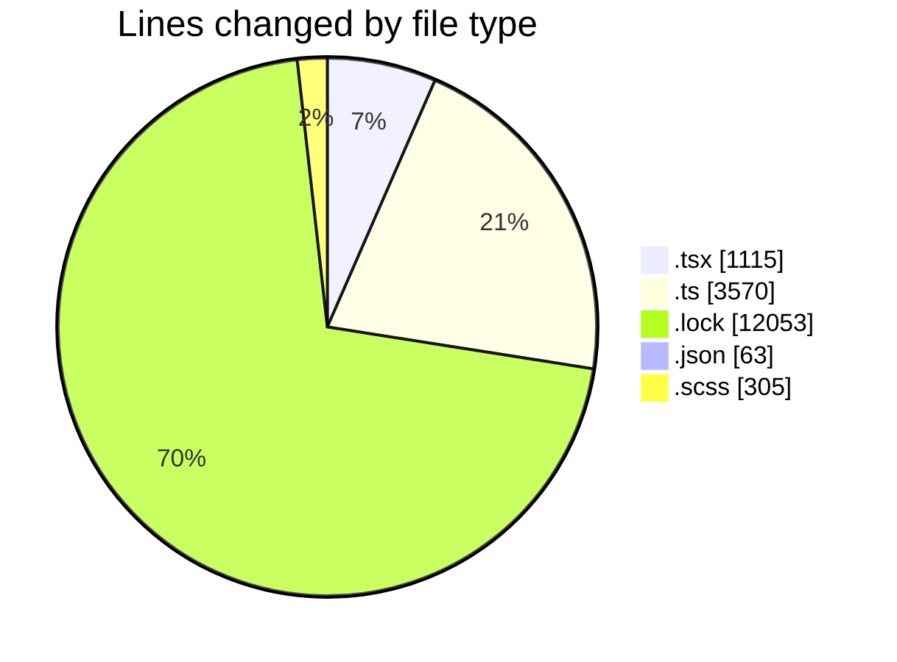
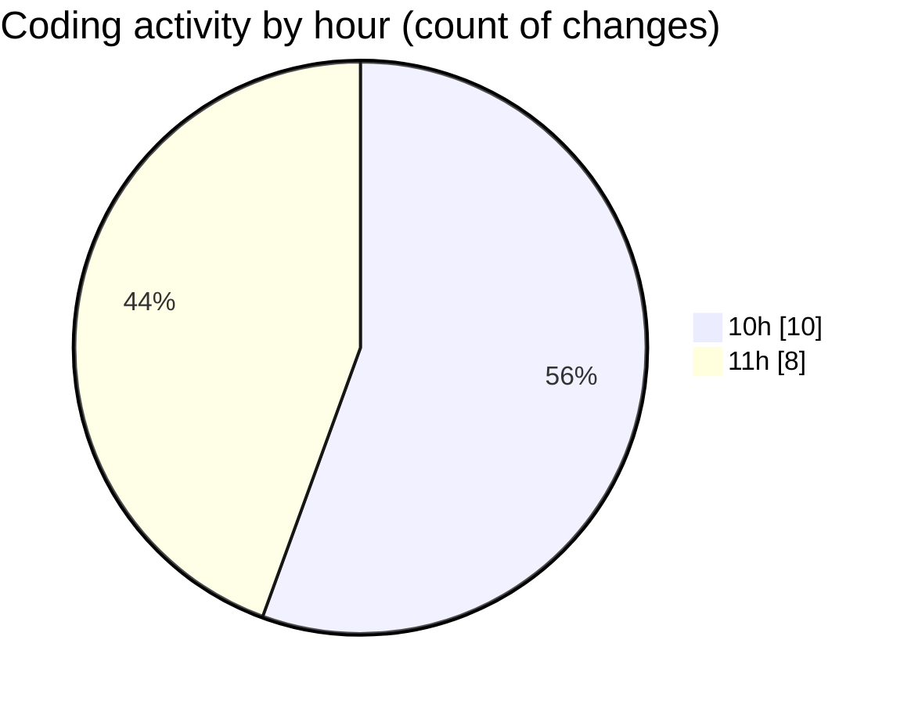

# cda - Activity Summary 

## Overall Statistics

| Stat                   | Value                                                             |
| ---------------------- | ----------------------------------------------------------------- |
| **Lines Added** (➕)   | 14653                                          |
| **Lines Removed** (➖) | 2453                                        |
| **Net Change** (↕)    | 12200                |
| **Active Time** (⌚)   | 17 minutes |

## Modified Files
- **Home.tsx** (+634, -200)
- **calendar-queries.ts** (+3404, -0)
- **yarn.lock** (+9828, -2225)
- **package.json** (+63, -0)
- **events.ts** (+138, -28)
- **EventCard.scss** (+305, -0)
- **MyEvents.tsx** (+127, -0)
- **Register.tsx** (+154, -0)

## Visualizations

### By File Type (Lines Changed)

### By Hour (Estimated Activity Count)

> **Last Updated:** 03/12/2025, 11:04:33