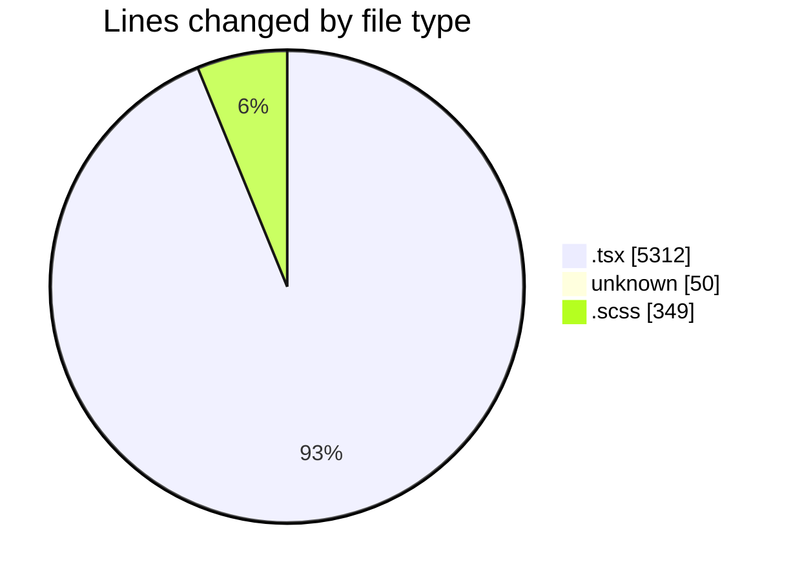
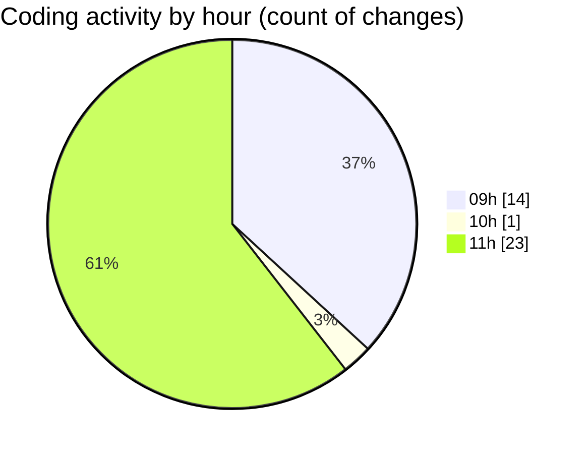

# cda - Activity Summary 

## Overall Statistics

| Stat                   | Value                                                             |
| ---------------------- | ----------------------------------------------------------------- |
| **Lines Added** (➕)   | 5677                                          |
| **Lines Removed** (➖) | 34                                        |
| **Net Change** (↕)    | 5643                |
| **Active Time** (⌚)   | 57 minutes |

## Modified Files
- **Attendees.test.tsx** (+12, -12)
- **Attendees.tsx** (+1, -1)
- **ContactCard.tsx** (+45, -0)
- **EventPage.test.tsx** (+1814, -5)
- **Home.test.tsx** (+661, -0)
- **EventPage.tsx** (+970, -0)
- **.env** (+50, -0)
- **EventCard.scss** (+348, -1)
- **EventCard.tsx** (+218, -2)
- **CapacityBadge.tsx** (+81, -5)
- **EventForm.tsx** (+1216, -8)
- **AddAttendeeModal.tsx** (+261, -0)

## Visualizations

### By File Type (Lines Changed)

### By Hour (Estimated Activity Count)

> **Last Updated:** 05/12/2025, 11:52:11