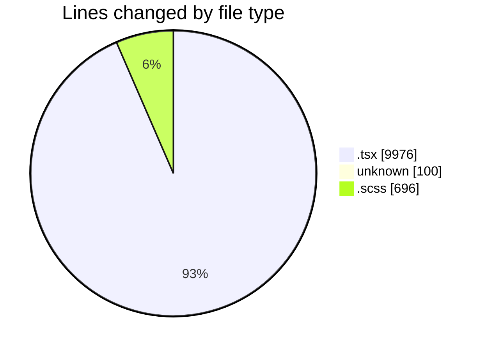
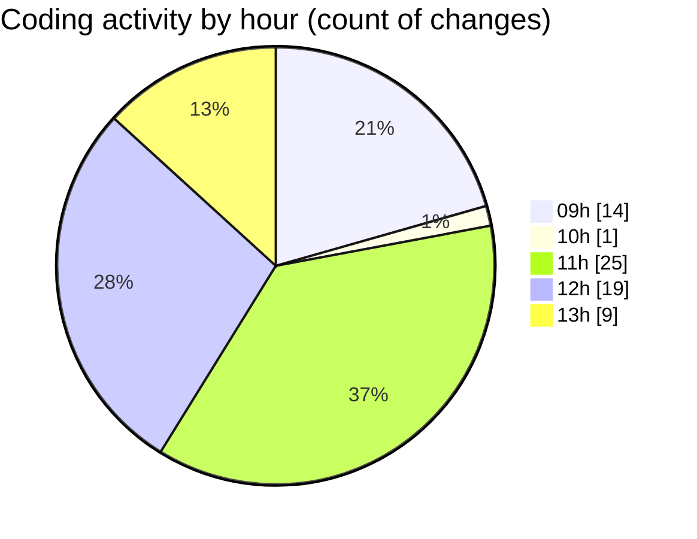

# cda - Activity Summary 

## Overall Statistics

| Stat                   | Value                                                             |
| ---------------------- | ----------------------------------------------------------------- |
| **Lines Added** (➕)   | 10484                                          |
| **Lines Removed** (➖) | 288                                        |
| **Net Change** (↕)    | 10196                |
| **Active Time** (⌚)   | 103 minutes |

## Modified Files
- **Attendees.test.tsx** (+12, -12)
- **Attendees.tsx** (+1, -1)
- **ContactCard.tsx** (+45, -0)
- **EventPage.test.tsx** (+1814, -13)
- **Home.test.tsx** (+1322, -5)
- **EventPage.tsx** (+1455, -0)
- **.env** (+100, -0)
- **EventCard.scss** (+695, -1)
- **EventCard.tsx** (+656, -224)
- **CapacityBadge.tsx** (+81, -5)
- **EventForm.tsx** (+1216, -8)
- **AddAttendeeModal.tsx** (+261, -0)
- **EventForm.test.tsx** (+973, -0)
- **AddAttendeeModal.test.tsx** (+558, -0)
- **Home.tsx** (+667, -7)
- **MyEvents.tsx** (+176, -8)
- **MyEvents.test.tsx** (+370, -4)
- **EventsList.tsx** (+82, -0)

## Visualizations

### By File Type (Lines Changed)

### By Hour (Estimated Activity Count)

> **Last Updated:** 05/12/2025, 13:26:55