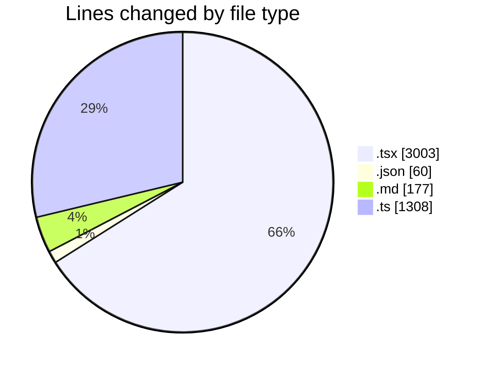
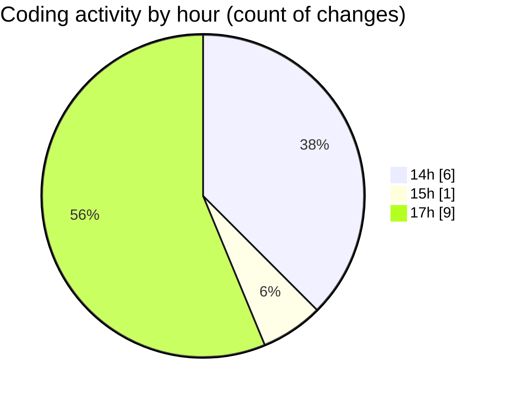

# cda - Activity Summary 

## Overall Statistics

| Stat                   | Value                                                             |
| ---------------------- | ----------------------------------------------------------------- |
| **Lines Added** (➕)   | 4507                                          |
| **Lines Removed** (➖) | 41                                        |
| **Net Change** (↕)    | 4466                |
| **Active Time** (⌚)   | 14 minutes |

## Modified Files
- **MyEvents.tsx** (+209, -41)
- **EventForm.test.tsx** (+973, -0)
- **EventForm.tsx** (+1208, -0)
- **settings.json** (+60, -0)
- **README.md** (+177, -0)
- **Home.tsx** (+327, -0)
- **index.ts** (+206, -0)
- **calendar.ts** (+1102, -0)
- **Attendees.tsx** (+245, -0)

## Visualizations

### By File Type (Lines Changed)

### By Hour (Estimated Activity Count)

> **Last Updated:** 08/12/2025, 17:42:58