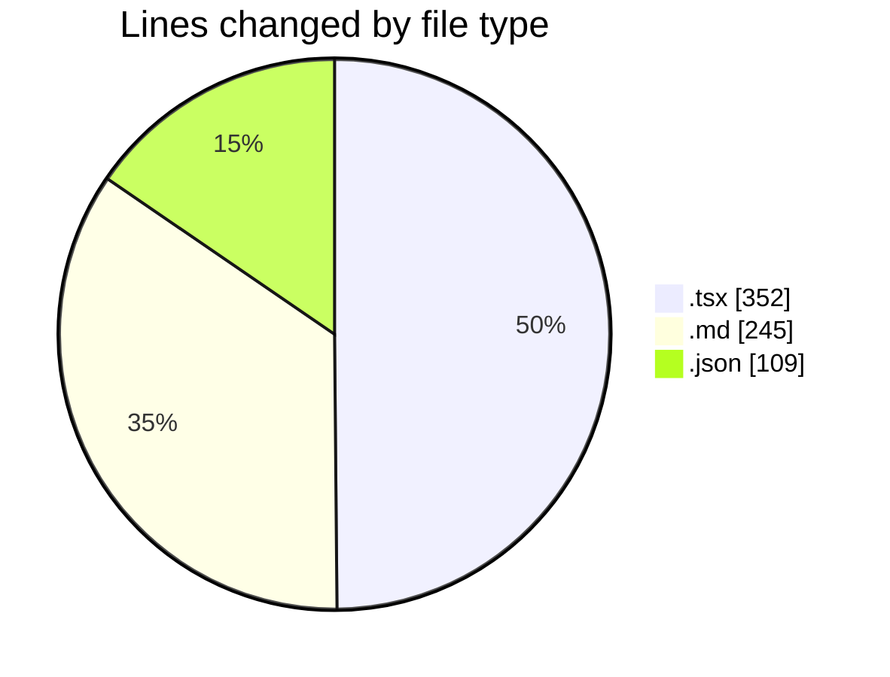
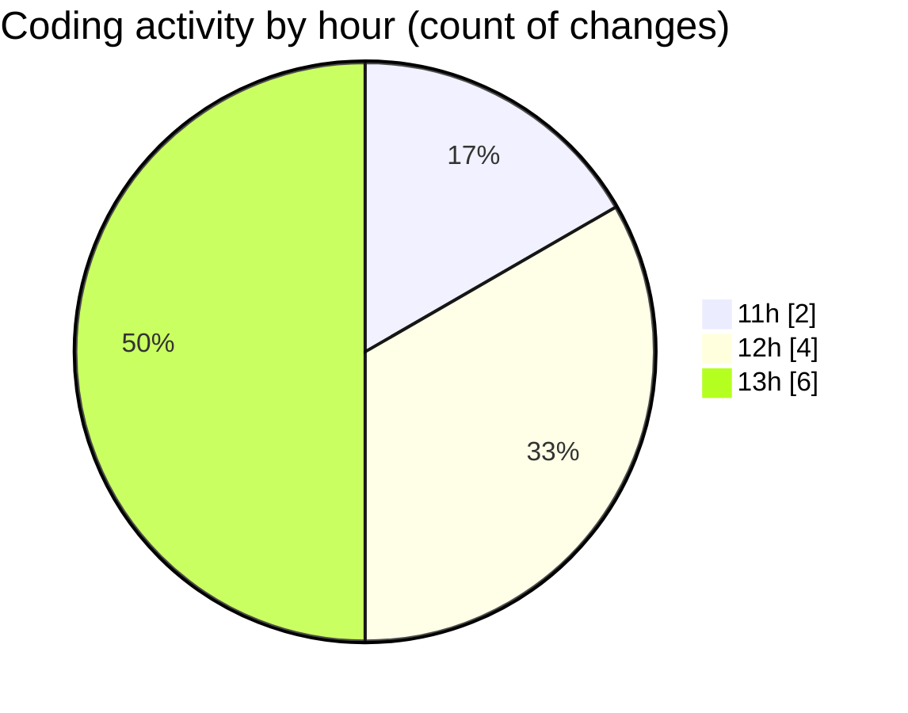

# cda - Activity Summary 

## Overall Statistics

| Stat                   | Value                                                             |
| ---------------------- | ----------------------------------------------------------------- |
| **Lines Added** (➕)   | 703                                          |
| **Lines Removed** (➖) | 3                                        |
| **Net Change** (↕)    | 700                |
| **Active Time** (⌚)   | 9 minutes |

## Modified Files
- **TruncatedJobTitle.tsx** (+108, -3)
- **README.md** (+245, -0)
- **package.json** (+24, -0)
- **package.json** (+85, -0)
- **Attendees.tsx** (+241, -0)

## Visualizations

### By File Type (Lines Changed)

### By Hour (Estimated Activity Count)

> **Last Updated:** 12/12/2025, 13:33:07