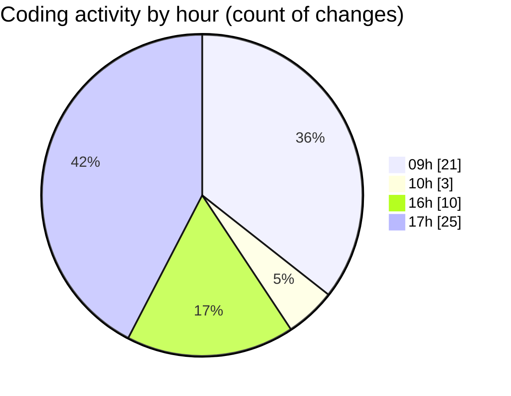

# cda - Activity Summary 

## Overall Statistics

| Stat                   | Value                                                             |
| ---------------------- | ----------------------------------------------------------------- |
| **Lines Added** (➕)   | 36413                                          |
| **Lines Removed** (➖) | 136                                        |
| **Net Change** (↕)    | 36277                |
| **Active Time** (⌚)   | 57 minutes |

## Modified Files
- **Home.tsx** (+328, -1)
- **calendar.ts** (+2220, -8)
- **events.ts** (+304, -14)
- **calendar-queries.ts** (+1795, -86)
- **calendar.js** (+347, -1)
- **skills.js** (+337, -6)
- **views.ts** (+9090, -0)
- **tables.ts** (+6338, -0)
- **transform-team-skill-favourites.test.ts** (+214, -0)
- **transform-skill-favourites.test.ts** (+444, -0)
- **skills.ts** (+239, -0)
- **skill-queries.ts** (+216, -0)
- **index.ts** (+222, -0)
- **graphql.ts** (+7830, -0)
- **graphql.ts** (+6013, -0)
- **gql.ts** (+196, -0)
- **package.json** (+48, -5)
- **setupTests.js** (+4, -0)
- **CertificateHtmlLink.test.js** (+36, -0)
- **App.js** (+35, -1)
- **index.js** (+24, -7)
- **CertificateHtmlLink.jsx** (+27, -0)
- **App.scss** (+35, -6)
- **form.scss** (+71, -1)

## Visualizations

### By File Type (Lines Changed)

### By Hour (Estimated Activity Count)

> **Last Updated:** 17/12/2025, 17:50:35