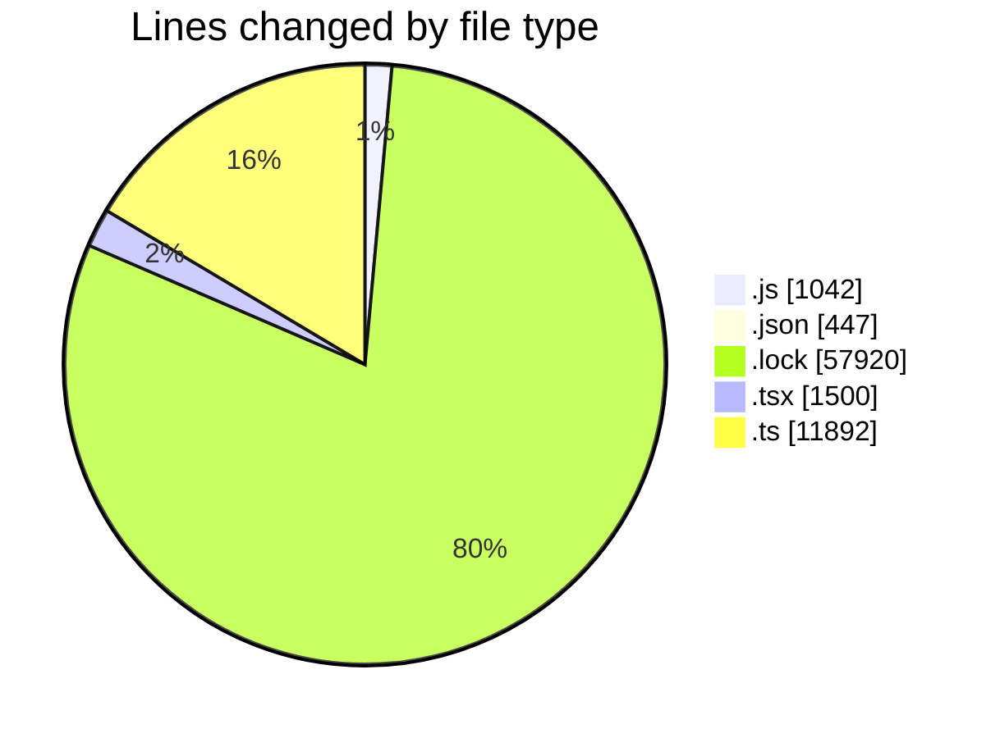
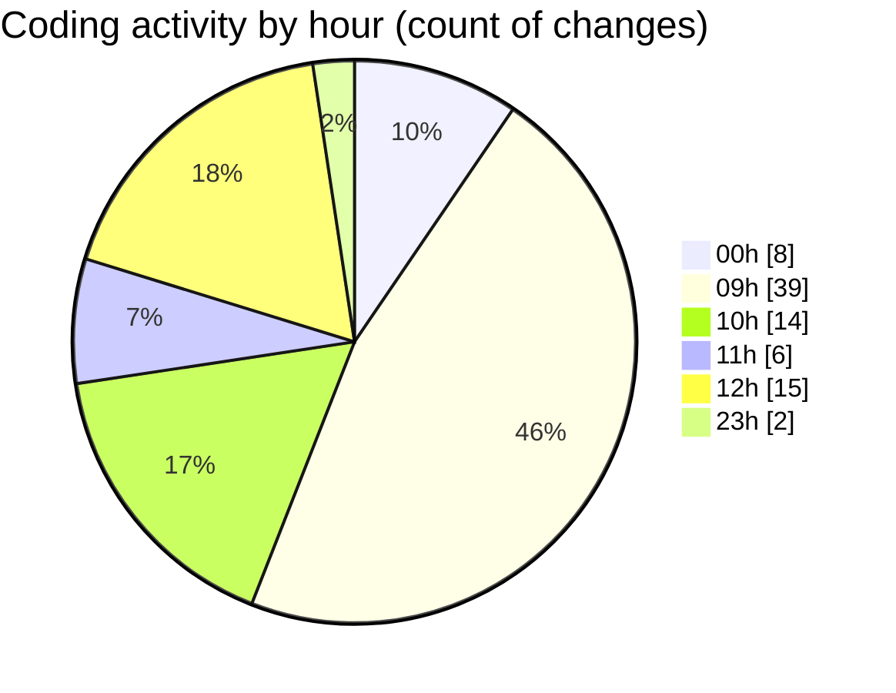

# cda - Activity Summary 

## Overall Statistics

| Stat                   | Value                                                             |
| ---------------------- | ----------------------------------------------------------------- |
| **Lines Added** (➕)   | 72663                                          |
| **Lines Removed** (➖) | 138                                        |
| **Net Change** (↕)    | 72525                |
| **Active Time** (⌚)   | 120 minutes |

## Modified Files
- **setupTests.js** (+7, -3)
- **package.json** (+22, -21)
- **setupTests.js** (+3, -0)
- **index.test.js** (+0, -1)
- **yarn.lock** (+14480, -0)
- **package.json** (+98, -10)
- **package.json** (+75, -1)
- **App.js** (+115, -27)
- **index.js** (+34, -1)
- **Home.js** (+246, -0)
- **envChecks.js** (+42, -0)
- **App.js** (+230, -56)
- **package.json** (+74, -0)
- **index.js** (+26, -0)
- **yarn.lock** (+28960, -0)
- **Home.js** (+230, -0)
- **index.js** (+18, -3)
- **yarn.lock** (+14480, -0)
- **package.json** (+143, -3)
- **App.tsx** (+77, -0)
- **Book.tsx** (+709, -3)
- **ProviderRouterTest.tsx** (+94, -8)
- **FindUser.tsx** (+174, -0)
- **index.tsx** (+98, -0)
- **setupTests.ts** (+21, -1)
- **Book.test.tsx** (+337, -0)
- **graphql.ts** (+6076, -0)
- **graphql.ts** (+5794, -0)

## Visualizations

### By File Type (Lines Changed)

### By Hour (Estimated Activity Count)

> **Last Updated:** 18/12/2025, 12:55:43