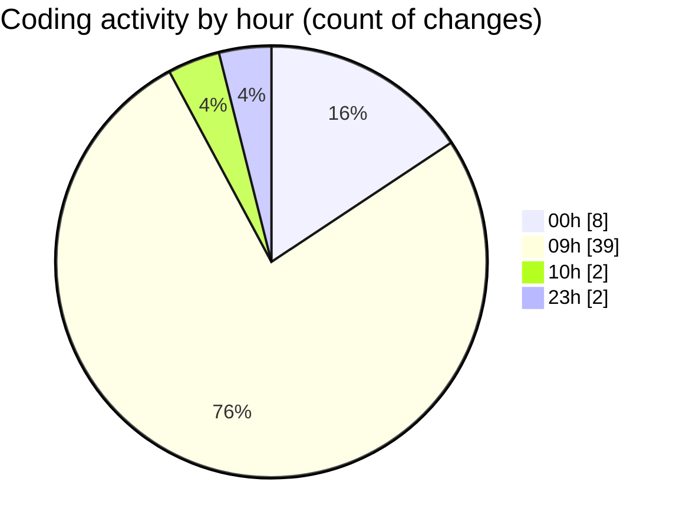

# cda - Activity Summary 

## Overall Statistics

| Stat                   | Value                                                             |
| ---------------------- | ----------------------------------------------------------------- |
| **Lines Added** (➕)   | 44449                                          |
| **Lines Removed** (➖) | 123                                        |
| **Net Change** (↕)    | 44326                |
| **Active Time** (⌚)   | 82 minutes |

## Modified Files
- **setupTests.js** (+7, -3)
- **package.json** (+22, -21)
- **setupTests.js** (+3, -0)
- **index.test.js** (+0, -1)
- **yarn.lock** (+14480, -0)
- **package.json** (+98, -10)
- **package.json** (+38, -1)
- **App.js** (+71, -27)
- **index.js** (+17, -1)
- **Home.js** (+133, -0)
- **envChecks.js** (+42, -0)
- **App.js** (+230, -56)
- **package.json** (+74, -0)
- **index.js** (+26, -0)
- **yarn.lock** (+28960, -0)
- **Home.js** (+230, -0)
- **index.js** (+18, -3)

## Visualizations

### By File Type (Lines Changed)

### By Hour (Estimated Activity Count)

> **Last Updated:** 18/12/2025, 10:01:24