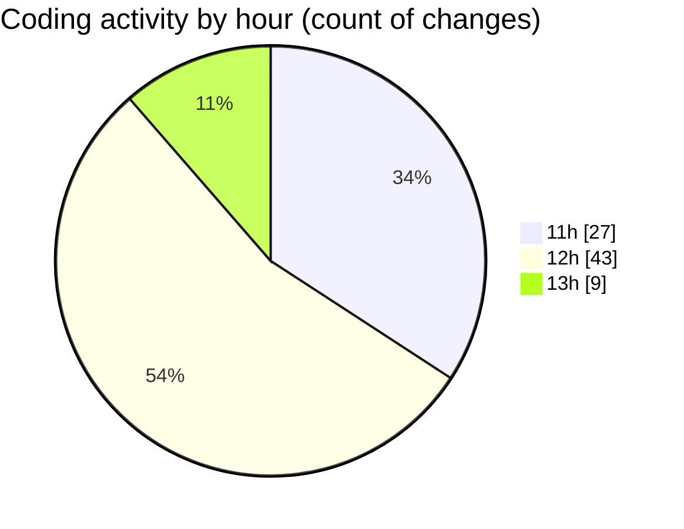

# cda - Activity Summary 

## Overall Statistics

| Stat                   | Value                                                             |
| ---------------------- | ----------------------------------------------------------------- |
| **Lines Added** (➕)   | 872                                          |
| **Lines Removed** (➖) | 268                                        |
| **Net Change** (↕)    | 604                |
| **Active Time** (⌚)   | 99 minutes |

## Modified Files
- **index.js** (+238, -3)
- **index.js** (+352, -182)
- **certificate-pdf.scss** (+109, -65)
- **App.js** (+34, -0)
- **_mixins.scss** (+59, -11)
- **_variables.scss** (+2, -0)
- **form.scss** (+78, -7)

## Visualizations

### By File Type (Lines Changed)

### By Hour (Estimated Activity Count)

> **Last Updated:** 05/01/2026, 13:14:08