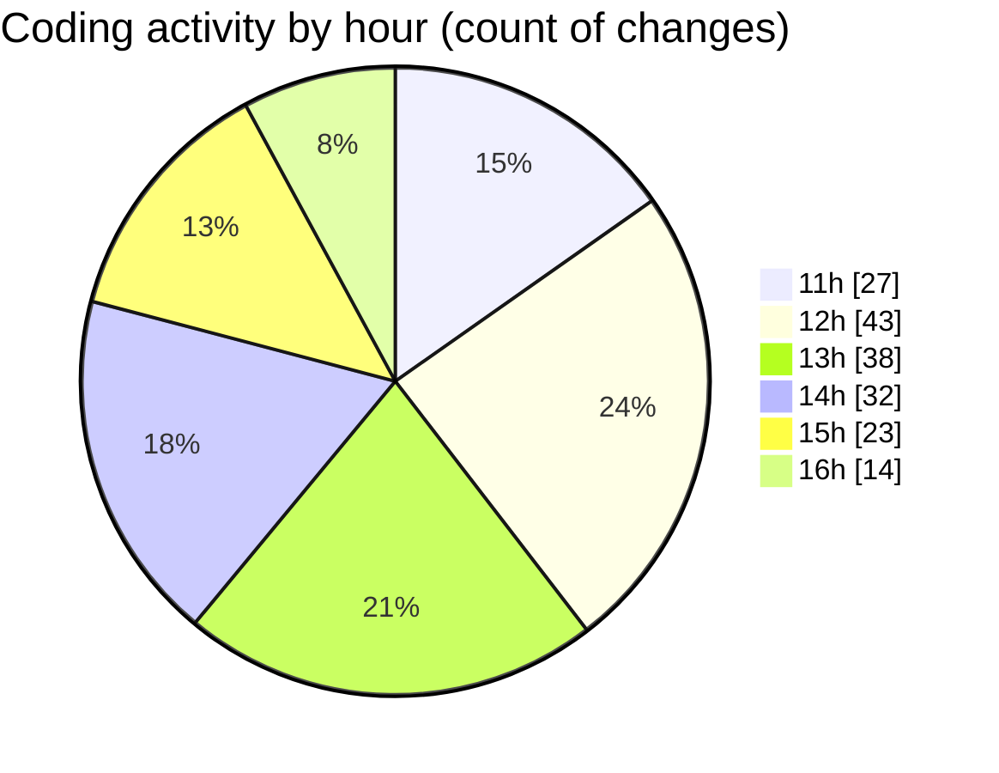

# cda - Activity Summary 

## Overall Statistics

| Stat                   | Value                                                             |
| ---------------------- | ----------------------------------------------------------------- |
| **Lines Added** (➕)   | 16508                                          |
| **Lines Removed** (➖) | 390                                        |
| **Net Change** (↕)    | 16118                |
| **Active Time** (⌚)   | 252 minutes |

## Modified Files
- **index.js** (+238, -3)
- **index.js** (+354, -183)
- **certificate-pdf.scss** (+134, -97)
- **App.js** (+35, -2)
- **_mixins.scss** (+68, -21)
- **_variables.scss** (+2, -0)
- **form.scss** (+78, -7)
- **utilities.js** (+91, -36)
- **package.json** (+54, -10)
- **yarn.lock** (+15086, -0)
- **Home.js** (+143, -28)
- **App.js** (+68, -0)
- **package.json** (+37, -0)
- **index.js** (+45, -1)
- **index.js** (+54, -0)
- **index.js** (+21, -2)

## Visualizations

### By File Type (Lines Changed)

### By Hour (Estimated Activity Count)

> **Last Updated:** 05/01/2026, 16:39:08