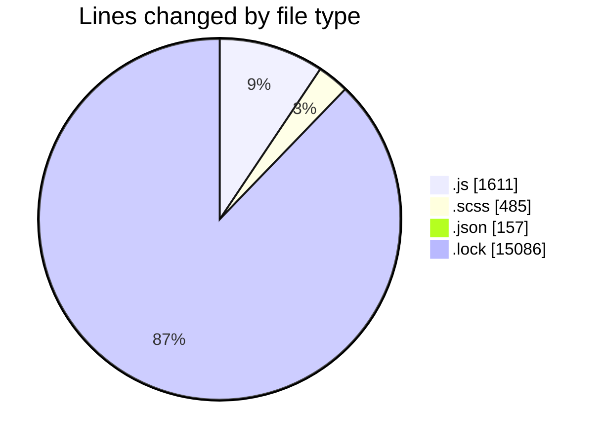
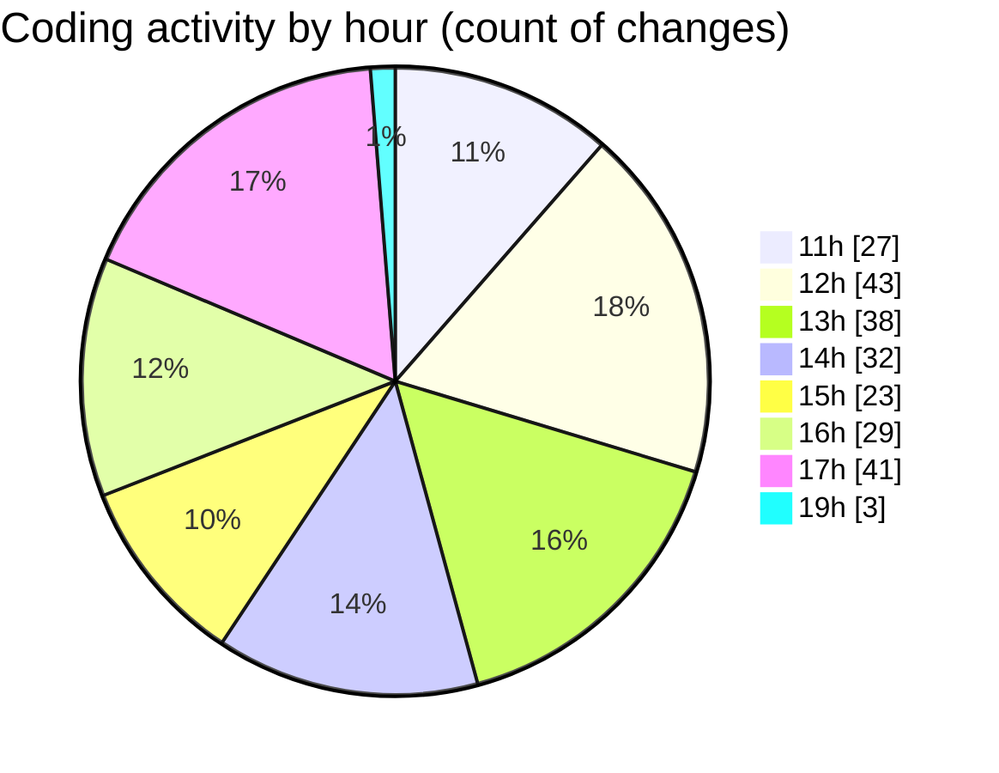

# cda - Activity Summary 

## Overall Statistics

| Stat                   | Value                                                             |
| ---------------------- | ----------------------------------------------------------------- |
| **Lines Added** (➕)   | 16872                                          |
| **Lines Removed** (➖) | 467                                        |
| **Net Change** (↕)    | 16405                |
| **Active Time** (⌚)   | 338 minutes |

## Modified Files
- **index.js** (+238, -3)
- **index.js** (+354, -183)
- **certificate-pdf.scss** (+134, -97)
- **App.js** (+35, -2)
- **_mixins.scss** (+68, -21)
- **_variables.scss** (+2, -0)
- **form.scss** (+78, -7)
- **utilities.js** (+91, -36)
- **package.json** (+54, -10)
- **yarn.lock** (+15086, -0)
- **Home.js** (+181, -42)
- **App.js** (+68, -0)
- **package.json** (+37, -0)
- **index.js** (+47, -3)
- **index.js** (+115, -7)
- **index.js** (+34, -21)
- **index.scss** (+49, -29)
- **package.json** (+51, -5)
- **App.js** (+150, -1)

## Visualizations

### By File Type (Lines Changed)

### By Hour (Estimated Activity Count)

> **Last Updated:** 05/01/2026, 19:57:38