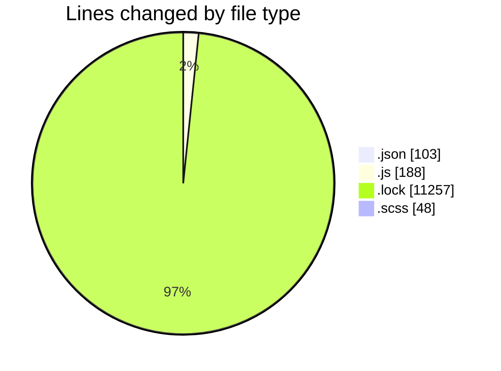
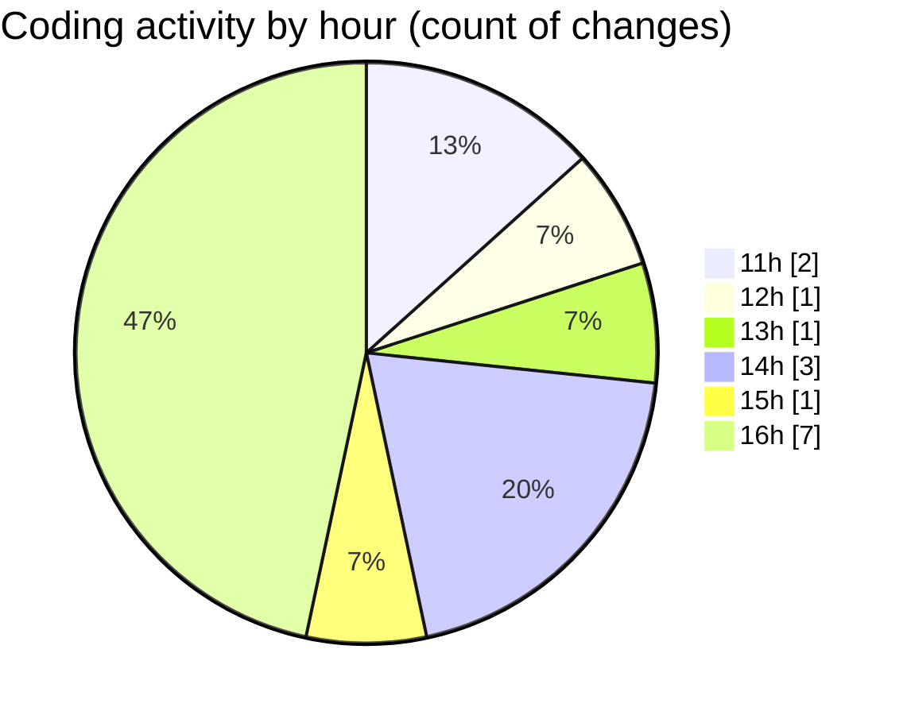

# cda - Activity Summary 

## Overall Statistics

| Stat                   | Value                                                             |
| ---------------------- | ----------------------------------------------------------------- |
| **Lines Added** (➕)   | 11587                                          |
| **Lines Removed** (➖) | 9                                        |
| **Net Change** (↕)    | 11578                |
| **Active Time** (⌚)   | 15 minutes |

## Modified Files
- **package.json** (+3, -0)
- **App.js** (+54, -3)
- **package.json** (+52, -0)
- **package.json** (+48, -0)
- **yarn.lock** (+11257, -0)
- **index.js** (+111, -6)
- **index.js** (+14, -0)
- **App.scss** (+48, -0)

## Visualizations

### By File Type (Lines Changed)

### By Hour (Estimated Activity Count)

> **Last Updated:** 06/01/2026, 16:34:13