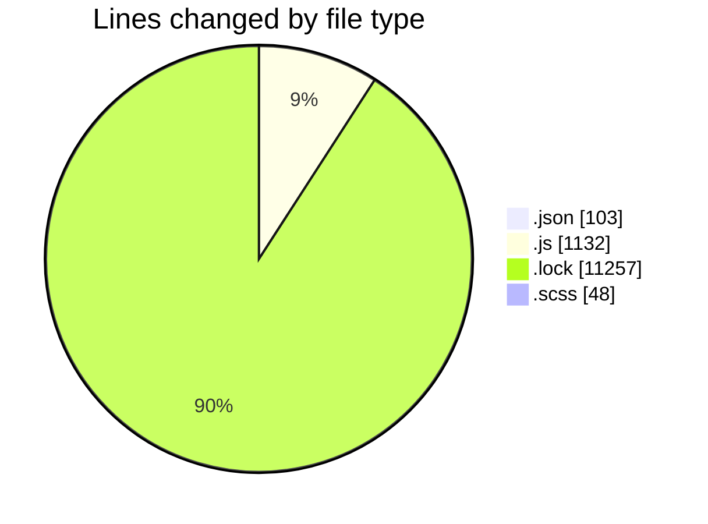
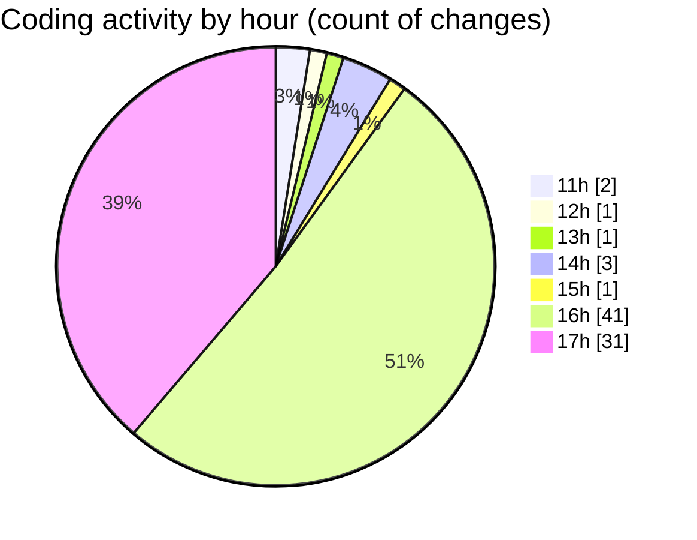

# cda - Activity Summary 

## Overall Statistics

| Stat                   | Value                                                             |
| ---------------------- | ----------------------------------------------------------------- |
| **Lines Added** (➕)   | 12297                                          |
| **Lines Removed** (➖) | 243                                        |
| **Net Change** (↕)    | 12054                |
| **Active Time** (⌚)   | 108 minutes |

## Modified Files
- **package.json** (+3, -0)
- **App.js** (+57, -3)
- **package.json** (+52, -0)
- **package.json** (+48, -0)
- **yarn.lock** (+11257, -0)
- **index.js** (+258, -162)
- **index.js** (+75, -57)
- **App.scss** (+48, -0)
- **index.js** (+51, -9)
- **index.js** (+95, -4)
- **index.js** (+87, -2)
- **index.js** (+83, -6)
- **index.js** (+112, -0)
- **index.js** (+71, -0)

## Visualizations

### By File Type (Lines Changed)

### By Hour (Estimated Activity Count)

> **Last Updated:** 06/01/2026, 17:14:13