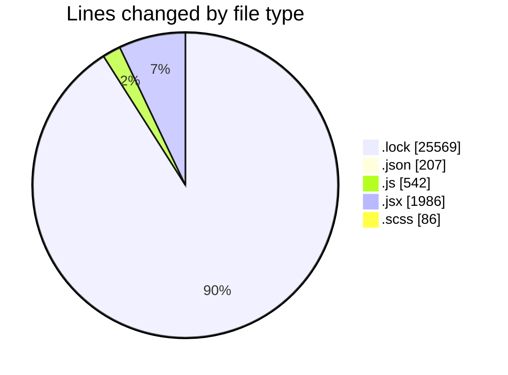
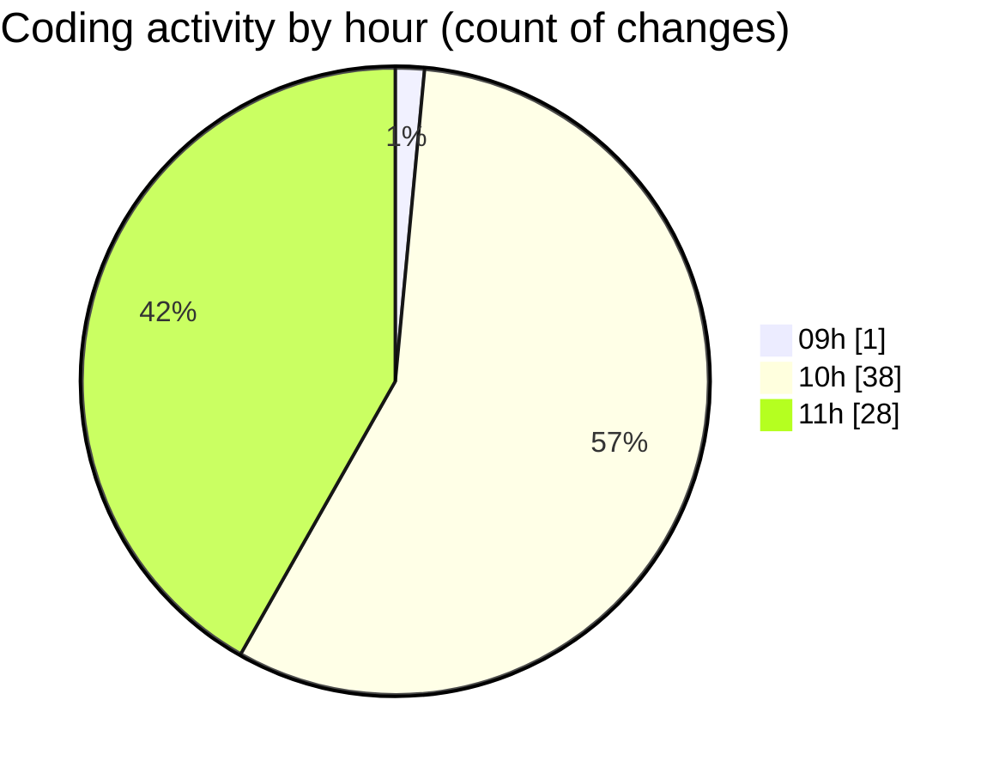

# cda - Activity Summary 

## Overall Statistics

| Stat                   | Value                                                             |
| ---------------------- | ----------------------------------------------------------------- |
| **Lines Added** (➕)   | 28253                                          |
| **Lines Removed** (➖) | 137                                        |
| **Net Change** (↕)    | 28116                |
| **Active Time** (⌚)   | 90 minutes |

## Modified Files
- **yarn.lock** (+14181, -0)
- **package.json** (+73, -0)
- **package.json** (+89, -0)
- **index.js** (+19, -0)
- **App.js** (+51, -0)
- **index.js** (+44, -0)
- **index.js** (+86, -0)
- **index.js** (+98, -0)
- **index.js** (+82, -0)
- **ExploreJobFamilies.jsx** (+148, -0)
- **App.js** (+162, -0)
- **TransparencyChart.jsx** (+1094, -132)
- **package.json** (+44, -1)
- **yarn.lock** (+11388, -0)
- **TransparencyChart.scss** (+86, -0)
- **ExploreJob.jsx** (+299, -1)
- **Explore.jsx** (+173, -1)
- **ExploreJob.test.jsx** (+105, -2)
- **ExploreTitle.jsx** (+31, -0)

## Visualizations

### By File Type (Lines Changed)

### By Hour (Estimated Activity Count)

> **Last Updated:** 07/01/2026, 11:35:05