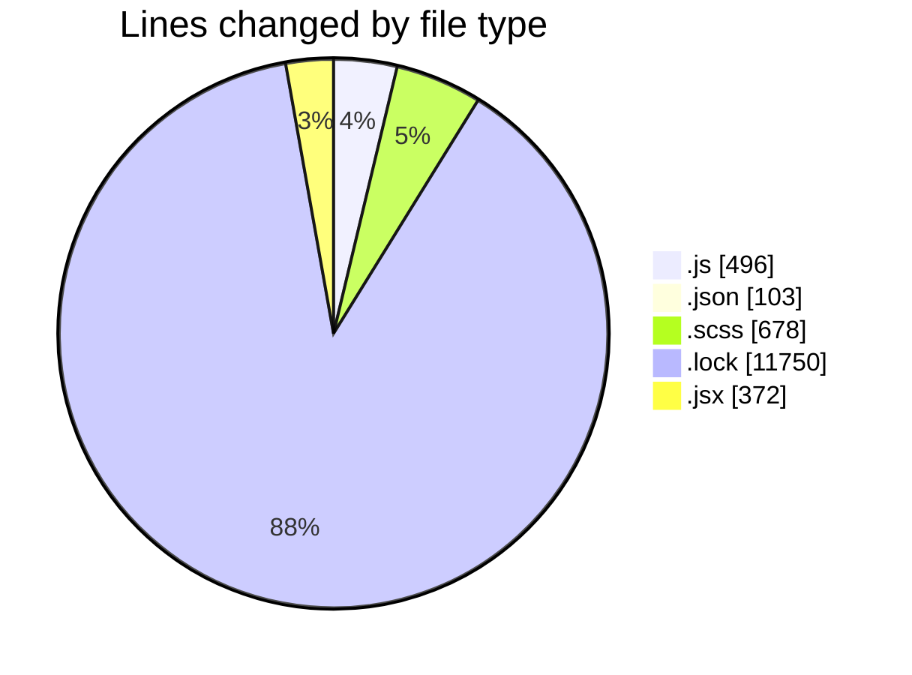
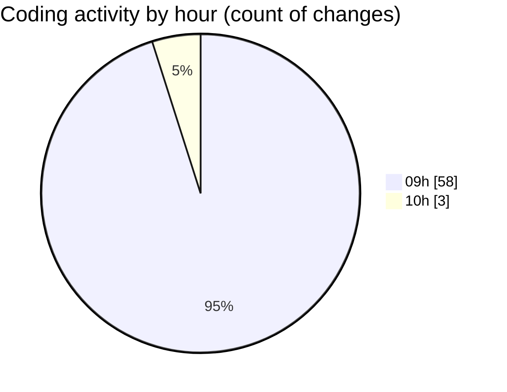

# cda - Activity Summary 

## Overall Statistics

| Stat                   | Value                                                             |
| ---------------------- | ----------------------------------------------------------------- |
| **Lines Added** (➕)   | 13369                                          |
| **Lines Removed** (➖) | 30                                        |
| **Net Change** (↕)    | 13339                |
| **Active Time** (⌚)   | 87 minutes |

## Modified Files
- **App.js** (+0, -2)
- **helpers.js** (+174, -0)
- **index.js** (+49, -2)
- **package.json** (+55, -1)
- **package.json** (+47, -0)
- **index.js** (+65, -0)
- **index.js** (+43, -0)
- **favourite-button.scss** (+443, -10)
- **yarn.lock** (+11750, -0)
- **App.js** (+84, -0)
- **index.scss** (+47, -0)
- **index.js** (+77, -0)
- **JobRow.jsx** (+56, -2)
- **JobRow.scss** (+24, -1)
- **ExploreJobFamilies.scss** (+29, -1)
- **You.jsx** (+131, -0)
- **CurrentUserJobDetails.scss** (+53, -7)
- **CurrentUserJobDetails.jsx** (+180, -3)
- **ExploreJob.scss** (+62, -1)

## Visualizations

### By File Type (Lines Changed)

### By Hour (Estimated Activity Count)

> **Last Updated:** 08/01/2026, 10:41:54