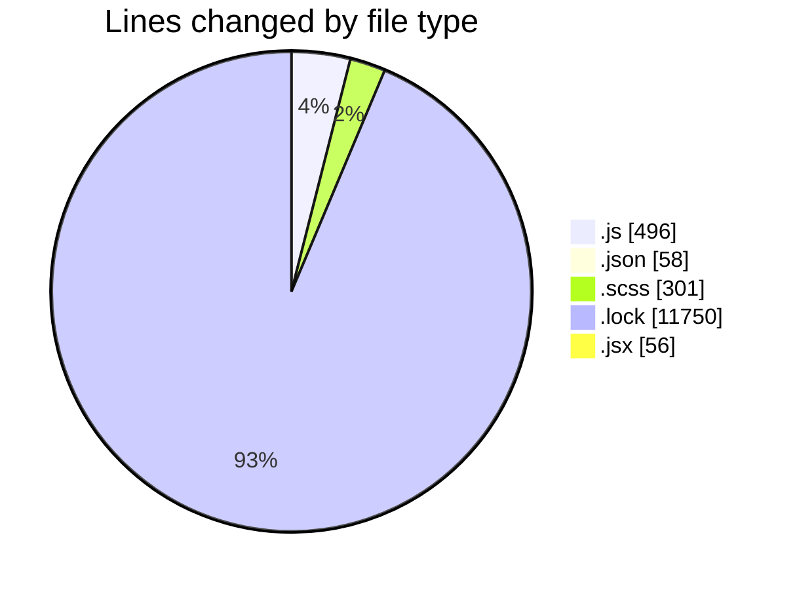
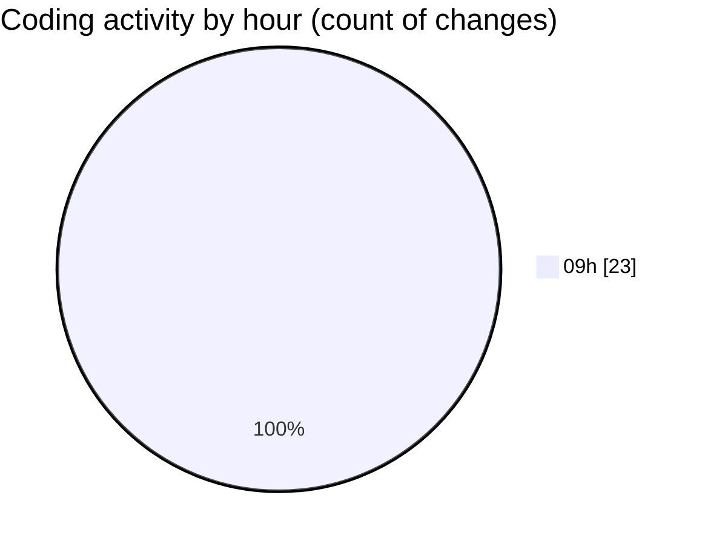

# cda - Activity Summary 

## Overall Statistics

| Stat                   | Value                                                             |
| ---------------------- | ----------------------------------------------------------------- |
| **Lines Added** (➕)   | 12644                                          |
| **Lines Removed** (➖) | 17                                        |
| **Net Change** (↕)    | 12627                |
| **Active Time** (⌚)   | 33 minutes |

## Modified Files
- **App.js** (+0, -2)
- **helpers.js** (+174, -0)
- **index.js** (+49, -2)
- **package.json** (+55, -1)
- **package.json** (+2, -0)
- **index.js** (+65, -0)
- **index.js** (+43, -0)
- **favourite-button.scss** (+224, -10)
- **yarn.lock** (+11750, -0)
- **App.js** (+84, -0)
- **index.scss** (+47, -0)
- **index.js** (+77, -0)
- **JobRow.jsx** (+54, -2)
- **JobRow.scss** (+20, -0)

## Visualizations

### By File Type (Lines Changed)

### By Hour (Estimated Activity Count)

> **Last Updated:** 08/01/2026, 09:31:31