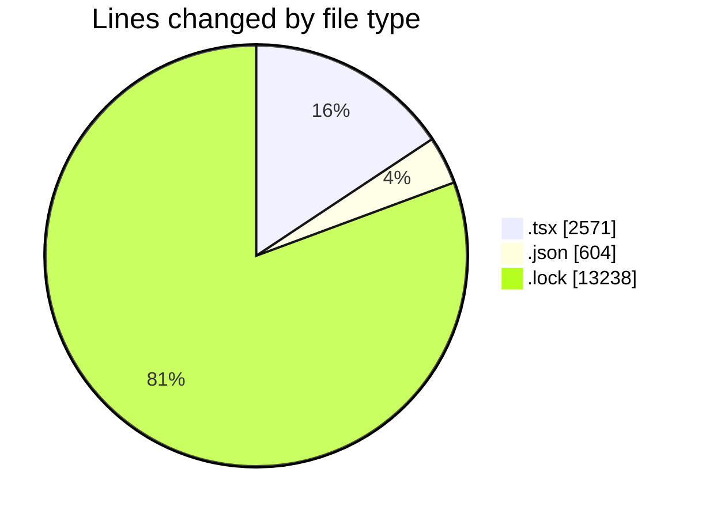
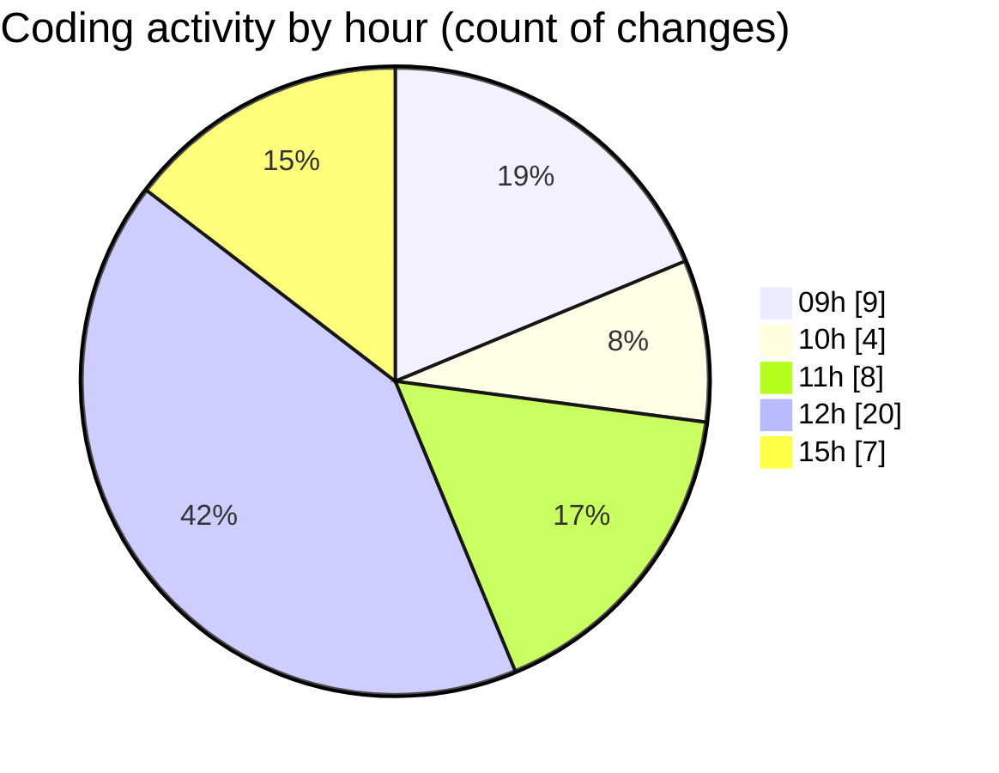

# cda - Activity Summary 

## Overall Statistics

| Stat                   | Value                                                             |
| ---------------------- | ----------------------------------------------------------------- |
| **Lines Added** (➕)   | 16378                                          |
| **Lines Removed** (➖) | 35                                        |
| **Net Change** (↕)    | 16343                |
| **Active Time** (⌚)   | 64 minutes |

## Modified Files
- **Header.tsx** (+1798, -30)
- **App.tsx** (+219, -3)
- **package.json** (+368, -0)
- **package.json** (+170, -0)
- **yarn.lock** (+13238, -0)
- **settings.json** (+64, -2)
- **Header.test.tsx** (+521, -0)

## Visualizations

### By File Type (Lines Changed)

### By Hour (Estimated Activity Count)

> **Last Updated:** 09/01/2026, 15:34:27