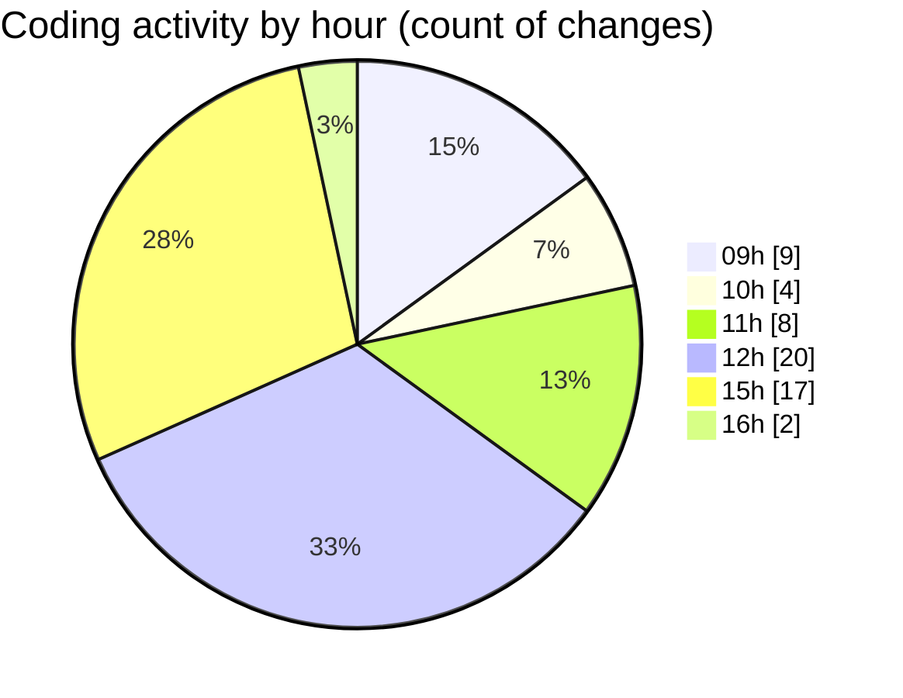

# cda - Activity Summary 

## Overall Statistics

| Stat                   | Value                                                             |
| ---------------------- | ----------------------------------------------------------------- |
| **Lines Added** (➕)   | 17251                                          |
| **Lines Removed** (➖) | 76                                        |
| **Net Change** (↕)    | 17175                |
| **Active Time** (⌚)   | 85 minutes |

## Modified Files
- **Header.tsx** (+1807, -68)
- **App.tsx** (+293, -6)
- **package.json** (+552, -0)
- **package.json** (+255, -0)
- **yarn.lock** (+13238, -0)
- **settings.json** (+64, -2)
- **Header.test.tsx** (+1042, -0)

## Visualizations

### By File Type (Lines Changed)

### By Hour (Estimated Activity Count)

> **Last Updated:** 09/01/2026, 16:09:27