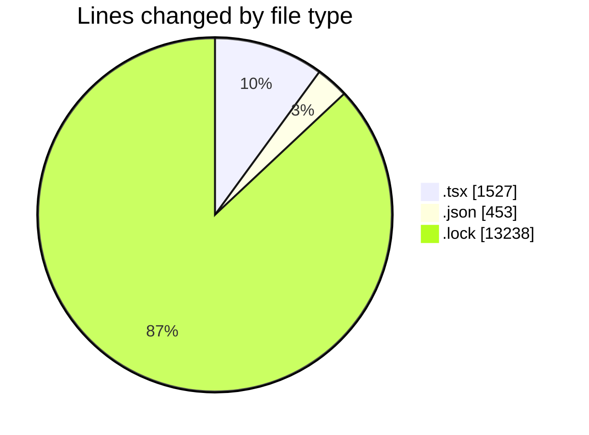
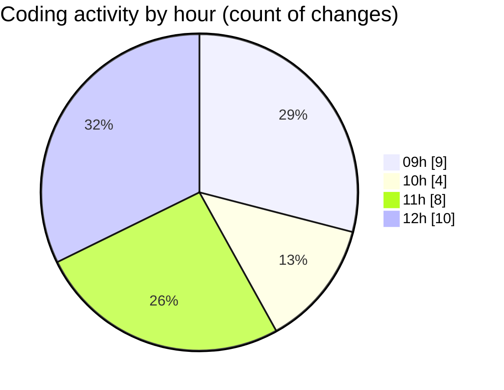

# cda - Activity Summary 

## Overall Statistics

| Stat                   | Value                                                             |
| ---------------------- | ----------------------------------------------------------------- |
| **Lines Added** (➕)   | 15205                                          |
| **Lines Removed** (➖) | 13                                        |
| **Net Change** (↕)    | 15192                |
| **Active Time** (⌚)   | 42 minutes |

## Modified Files
- **Header.tsx** (+1295, -10)
- **App.tsx** (+219, -3)
- **package.json** (+368, -0)
- **package.json** (+85, -0)
- **yarn.lock** (+13238, -0)

## Visualizations

### By File Type (Lines Changed)

### By Hour (Estimated Activity Count)

> **Last Updated:** 09/01/2026, 12:13:32