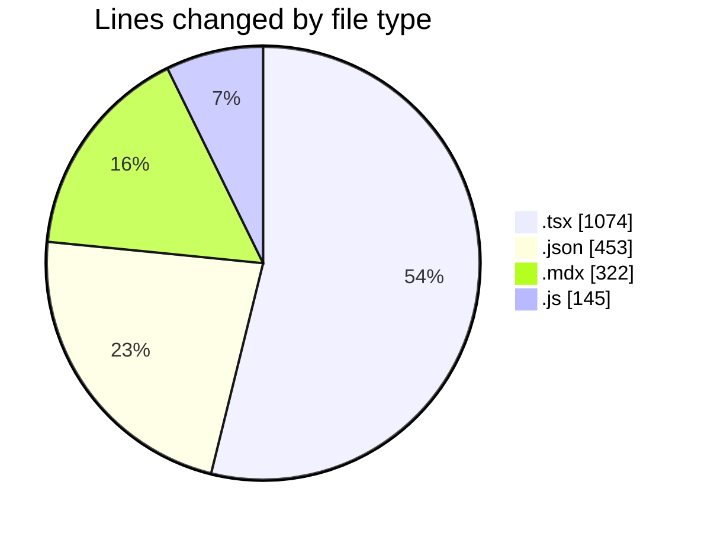
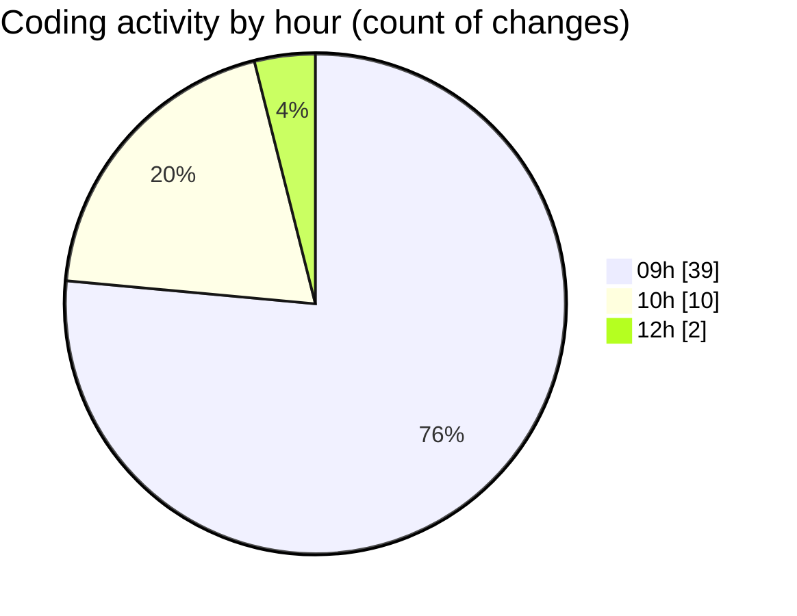

# cda - Activity Summary 

## Overall Statistics

| Stat                   | Value                                                             |
| ---------------------- | ----------------------------------------------------------------- |
| **Lines Added** (➕)   | 1958                                          |
| **Lines Removed** (➖) | 36                                        |
| **Net Change** (↕)    | 1922                |
| **Active Time** (⌚)   | 78 minutes |

## Modified Files
- **Header.tsx** (+432, -7)
- **package.json** (+368, -0)
- **Header.mdx** (+295, -27)
- **Header.stories.js** (+145, -0)
- **package.json** (+85, -0)
- **App.tsx** (+66, -0)
- **Header.test.tsx** (+567, -2)

## Visualizations

### By File Type (Lines Changed)

### By Hour (Estimated Activity Count)

> **Last Updated:** 12/01/2026, 12:53:09