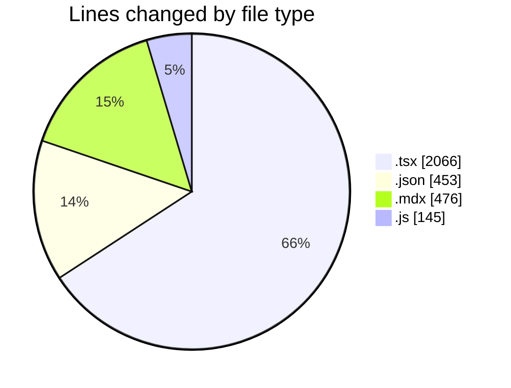
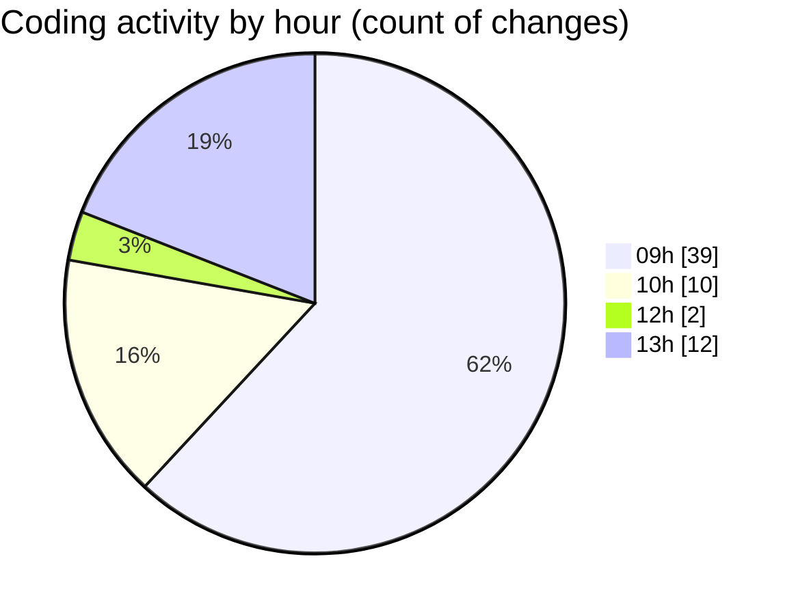

# cda - Activity Summary 

## Overall Statistics

| Stat                   | Value                                                             |
| ---------------------- | ----------------------------------------------------------------- |
| **Lines Added** (➕)   | 3092                                          |
| **Lines Removed** (➖) | 48                                        |
| **Net Change** (↕)    | 3044                |
| **Active Time** (⌚)   | 93 minutes |

## Modified Files
- **Header.tsx** (+858, -8)
- **package.json** (+368, -0)
- **Header.mdx** (+438, -38)
- **Header.stories.js** (+145, -0)
- **package.json** (+85, -0)
- **App.tsx** (+66, -0)
- **Header.test.tsx** (+1132, -2)

## Visualizations

### By File Type (Lines Changed)

### By Hour (Estimated Activity Count)

> **Last Updated:** 12/01/2026, 13:54:12