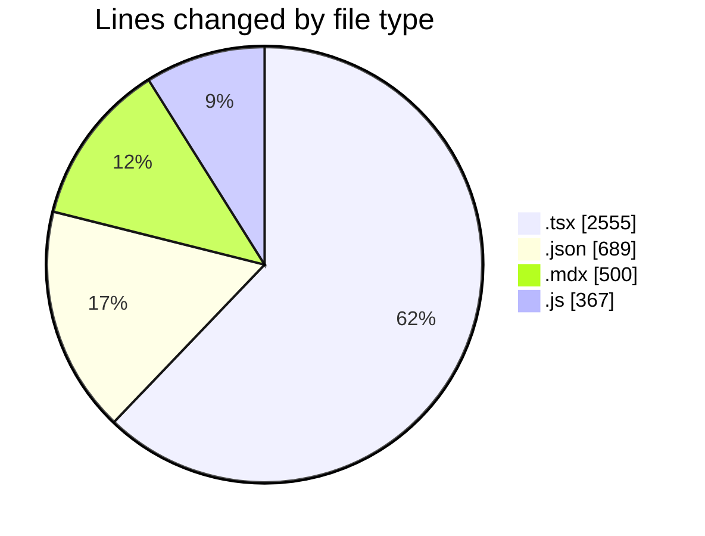
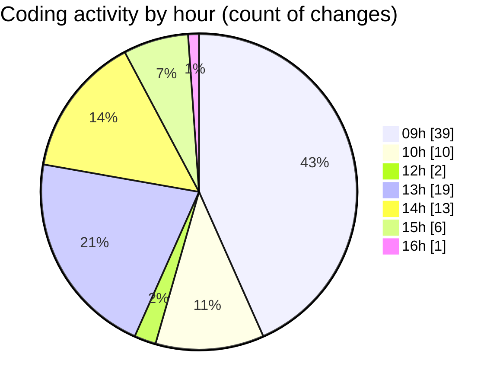

# cda - Activity Summary 

## Overall Statistics

| Stat                   | Value                                                             |
| ---------------------- | ----------------------------------------------------------------- |
| **Lines Added** (➕)   | 4004                                          |
| **Lines Removed** (➖) | 107                                        |
| **Net Change** (↕)    | 3897                |
| **Active Time** (⌚)   | 136 minutes |

## Modified Files
- **Header.tsx** (+1283, -8)
- **package.json** (+552, -0)
- **Header.mdx** (+450, -50)
- **Header.stories.js** (+145, -0)
- **package.json** (+85, -0)
- **App.tsx** (+66, -0)
- **Header.test.tsx** (+1164, -34)
- **App.js** (+49, -5)
- **package.json** (+51, -1)
- **Answer.test.js** (+63, -8)
- **agentsConfig.js** (+96, -1)

## Visualizations

### By File Type (Lines Changed)

### By Hour (Estimated Activity Count)

> **Last Updated:** 12/01/2026, 16:29:12