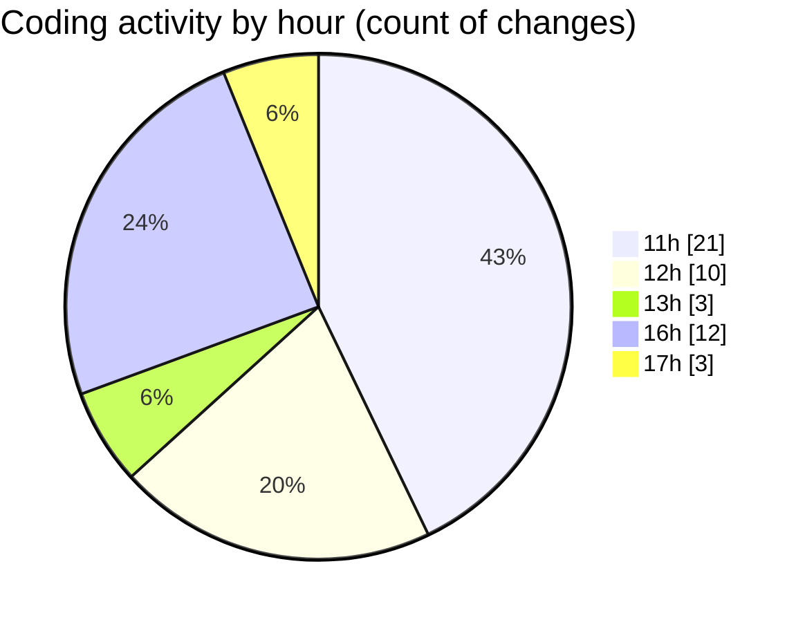

# cda - Activity Summary 

## Overall Statistics

| Stat                   | Value                                                             |
| ---------------------- | ----------------------------------------------------------------- |
| **Lines Added** (➕)   | 12289                                          |
| **Lines Removed** (➖) | 234                                        |
| **Net Change** (↕)    | 12055                |
| **Active Time** (⌚)   | 57 minutes |

## Modified Files
- **agentsConfig.js** (+271, -101)
- **App.tsx** (+131, -0)
- **yarn.lock** (+11591, -60)
- **package.json** (+51, -1)
- **environmentChecks.js** (+132, -40)
- **package.json** (+74, -3)
- **setupTests.js** (+28, -23)
- **jest.polyfills.js** (+11, -6)

## Visualizations

### By File Type (Lines Changed)

### By Hour (Estimated Activity Count)

> **Last Updated:** 13/01/2026, 17:02:55