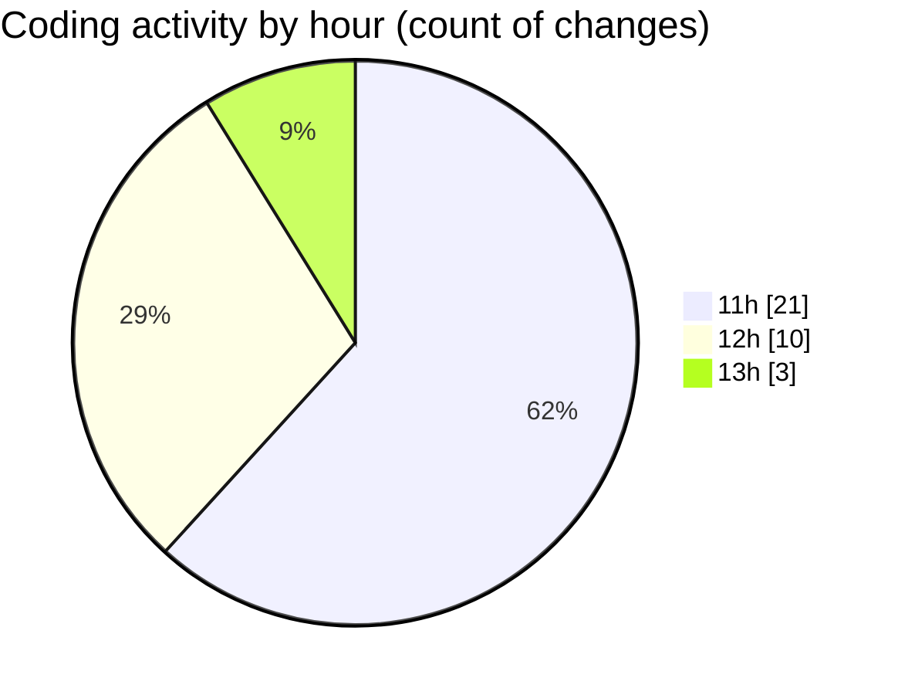

# cda - Activity Summary 

## Overall Statistics

| Stat                   | Value                                                             |
| ---------------------- | ----------------------------------------------------------------- |
| **Lines Added** (➕)   | 12176                                          |
| **Lines Removed** (➖) | 186                                        |
| **Net Change** (↕)    | 11990                |
| **Active Time** (⌚)   | 39 minutes |

## Modified Files
- **agentsConfig.js** (+271, -85)
- **App.tsx** (+131, -0)
- **yarn.lock** (+11591, -60)
- **package.json** (+51, -1)
- **environmentChecks.js** (+132, -40)

## Visualizations

### By File Type (Lines Changed)

### By Hour (Estimated Activity Count)

> **Last Updated:** 13/01/2026, 13:17:54