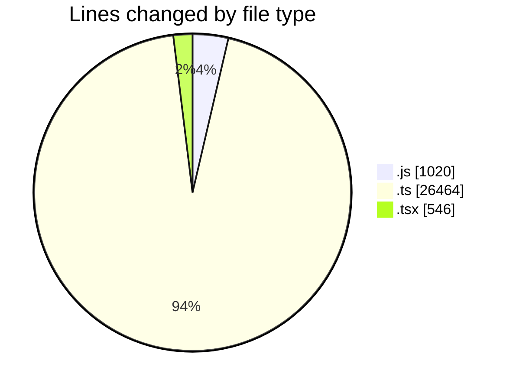
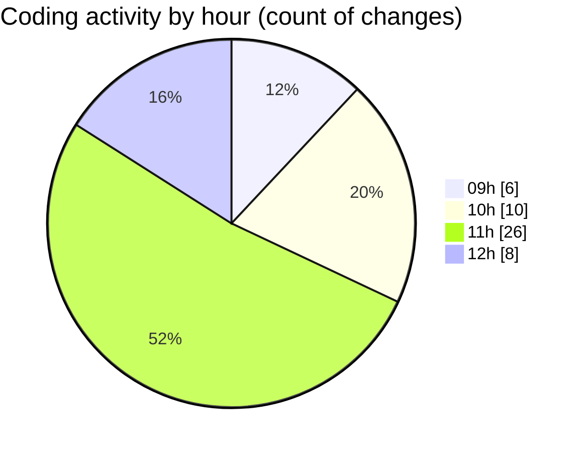

# cda - Activity Summary 

## Overall Statistics

| Stat                   | Value                                                             |
| ---------------------- | ----------------------------------------------------------------- |
| **Lines Added** (➕)   | 27984                                          |
| **Lines Removed** (➖) | 46                                        |
| **Net Change** (↕)    | 27938                |
| **Active Time** (⌚)   | 73 minutes |

## Modified Files
- **peopleview.js** (+370, -0)
- **resolvers-types.ts** (+10197, -0)
- **resolvers-types.ts** (+13995, -0)
- **fieldUtils.ts** (+392, -0)
- **profile.js** (+1, -0)
- **profile.test.js** (+22, -10)
- **peopleview-queries.js** (+617, -0)
- **queries.ts** (+1561, -17)
- **UsefulNumbers.tsx** (+106, -0)
- **ProfileContainer.test.tsx** (+257, -12)
- **ProfileContainer.tsx** (+88, -7)
- **ConstructDefinitionListItem.tsx** (+76, -0)
- **Profile.types.ts** (+302, -0)

## Visualizations

### By File Type (Lines Changed)

### By Hour (Estimated Activity Count)

> **Last Updated:** 15/01/2026, 12:06:44