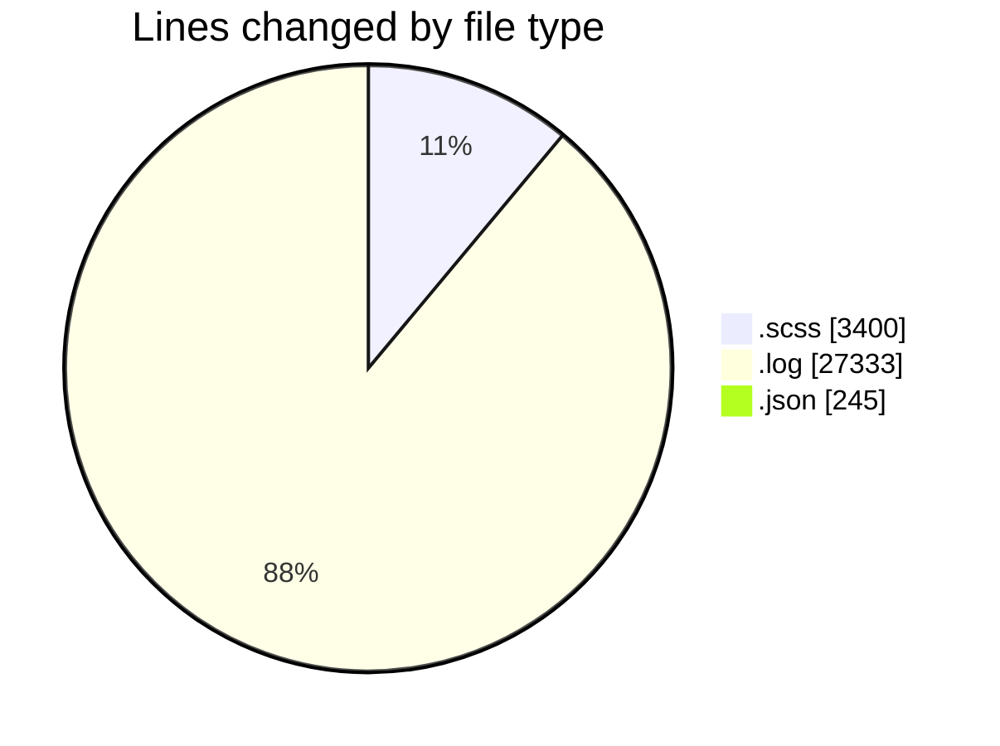
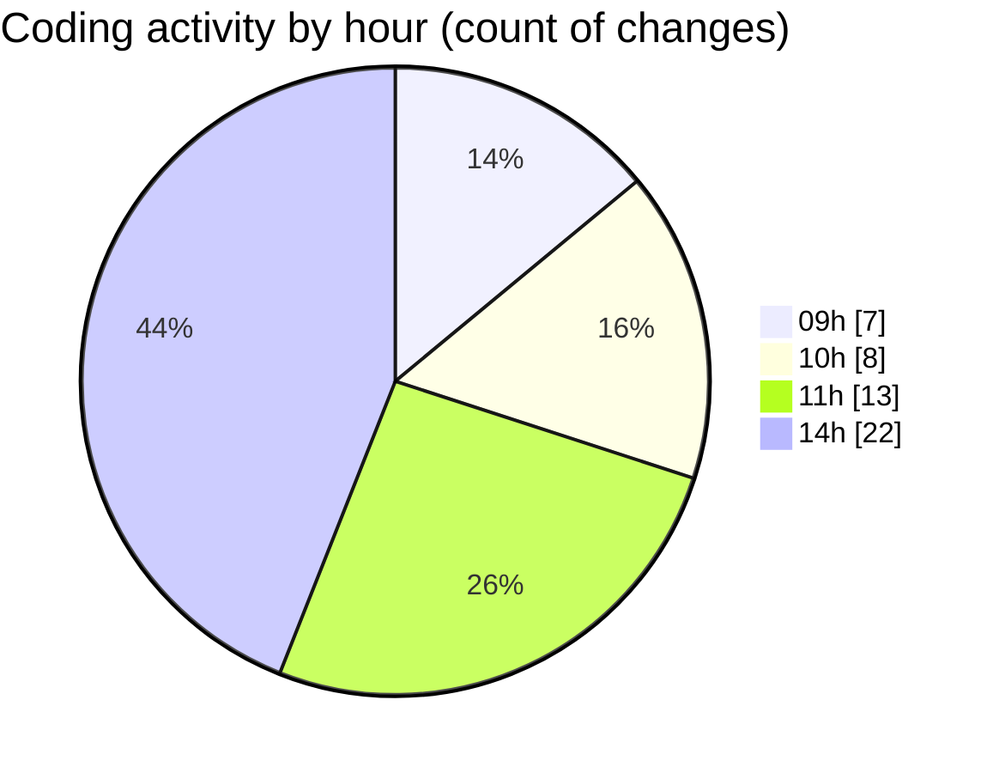

# cda - Activity Summary 

## Overall Statistics

| Stat                   | Value                                                             |
| ---------------------- | ----------------------------------------------------------------- |
| **Lines Added** (➕)   | 18179                                          |
| **Lines Removed** (➖) | 12799                                        |
| **Net Change** (↕)    | 5380                |
| **Active Time** (⌚)   | 64 minutes |

## Modified Files
- **index.scss** (+120, -1)
- **_table.scss** (+583, -1)
- **_input.scss** (+547, -0)
- **_mq.scss** (+305, -0)
- **debug-storybook.log** (+14541, -12792)
- **_button.scss** (+97, -1)
- **_input.scss** (+273, -0)
- **usefulLinks.scss** (+104, -0)
- **_button.scss** (+486, -0)
- **_banner.scss** (+39, -1)
- **_breakpoints.scss** (+13, -0)
- **package.json** (+181, -2)
- **_background.scss** (+18, -0)
- **_breakpoints.scss** (+135, -0)
- **_grid.scss** (+27, -0)
- **_forms.scss** (+83, -1)
- **_base.scss** (+36, -0)
- **_type.scss** (+441, -0)
- **_media.scss** (+88, -0)
- **settings.json** (+62, -0)

## Visualizations

### By File Type (Lines Changed)

### By Hour (Estimated Activity Count)

> **Last Updated:** 21/01/2026, 14:55:13