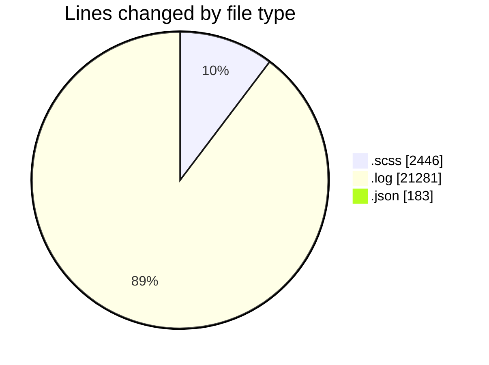
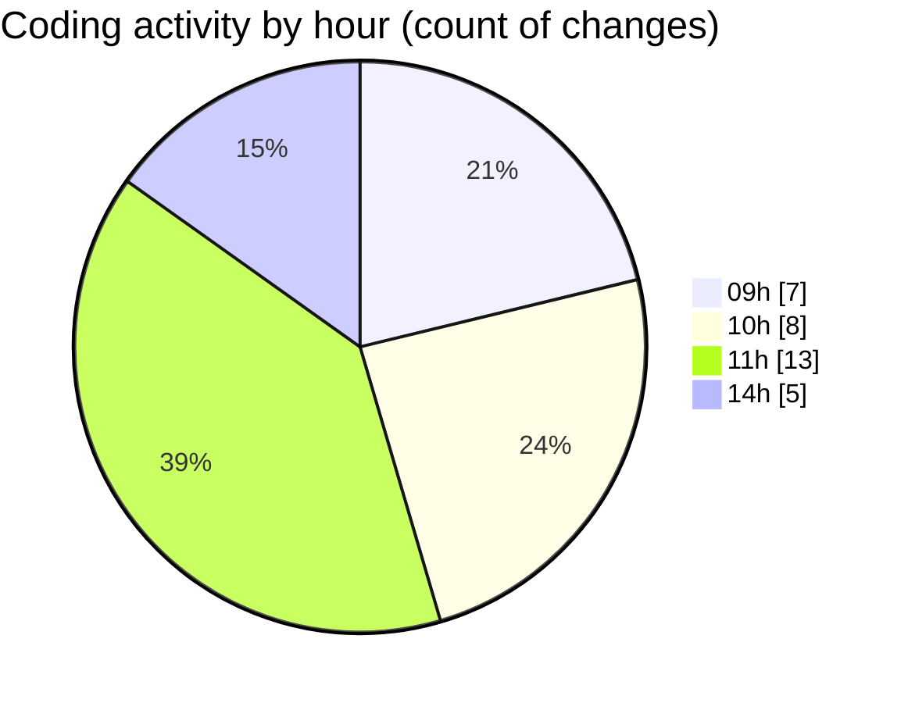

# cda - Activity Summary 

## Overall Statistics

| Stat                   | Value                                                             |
| ---------------------- | ----------------------------------------------------------------- |
| **Lines Added** (➕)   | 15416                                          |
| **Lines Removed** (➖) | 8494                                        |
| **Net Change** (↕)    | 6922                |
| **Active Time** (⌚)   | 44 minutes |

## Modified Files
- **index.scss** (+120, -1)
- **_table.scss** (+289, -1)
- **_input.scss** (+546, -0)
- **_mq.scss** (+305, -0)
- **debug-storybook.log** (+12793, -8488)
- **_button.scss** (+95, -1)
- **_input.scss** (+273, -0)
- **usefulLinks.scss** (+104, -0)
- **_button.scss** (+481, -0)
- **_banner.scss** (+36, -1)
- **_breakpoints.scss** (+13, -0)
- **package.json** (+181, -2)
- **_background.scss** (+18, -0)
- **_breakpoints.scss** (+135, -0)
- **_grid.scss** (+27, -0)

## Visualizations

### By File Type (Lines Changed)

### By Hour (Estimated Activity Count)

> **Last Updated:** 21/01/2026, 14:40:13