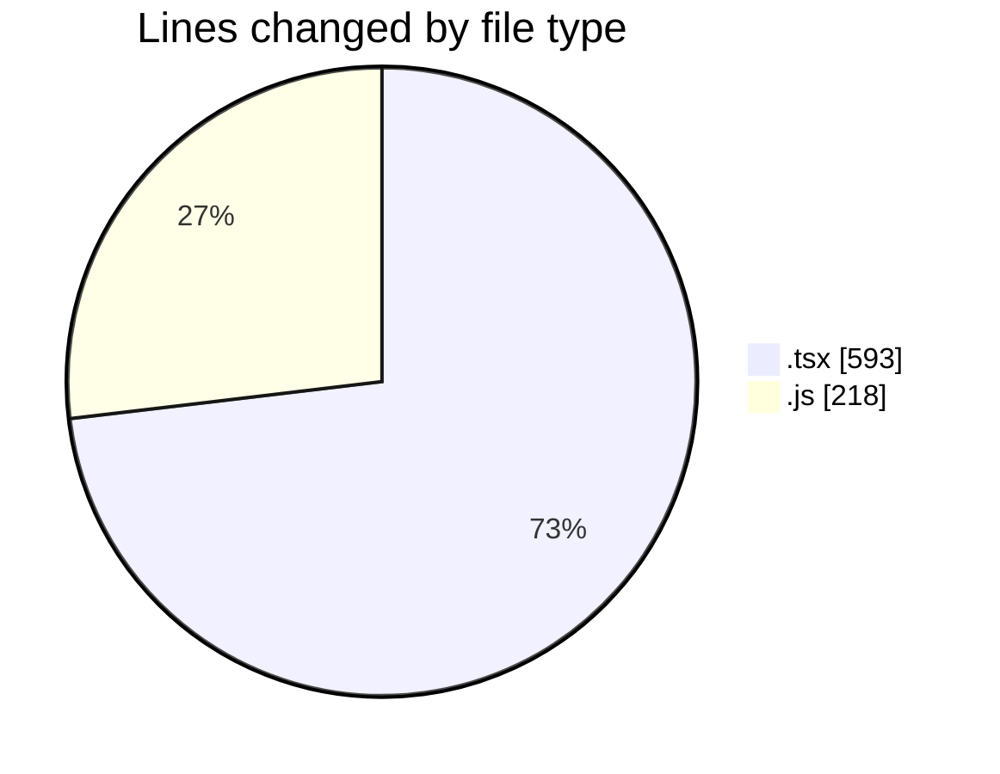

# cda-web-components - Activity Summary 

## Overall Statistics

| Stat                   | Value                                                             |
| ---------------------- | ----------------------------------------------------------------- |
| **Lines Added** (➕)   | 761                                          |
| **Lines Removed** (➖) | 50                                        |
| **Net Change** (↕)    | 711                |
| **Active Time** (⌚)   | 30 minutes |

## Modified Files
- **useSetFilters.test.tsx** (+127, -30)
- **index.js** (+129, -15)
- **index.tsx** (+126, -4)
- **index.js** (+74, -0)
- **FeedbackModal.tsx** (+305, -1)

## Visualizations

### By File Type (Lines Changed)

### By Hour (Estimated Activity Count)

> **Last Updated:** 22/01/2026, 15:40:57