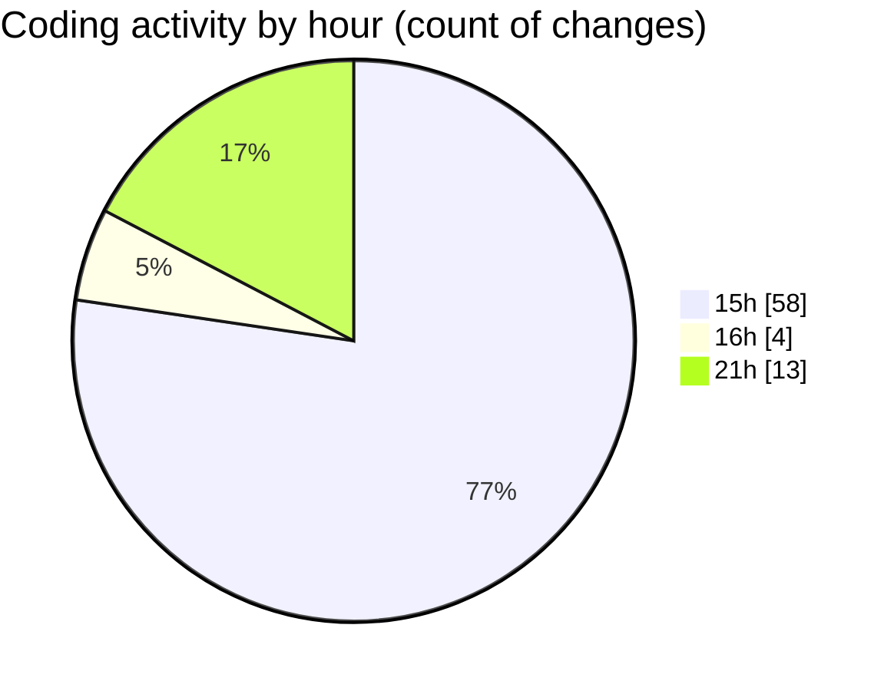

# cda-web-components - Activity Summary 

## Overall Statistics

| Stat                   | Value                                                             |
| ---------------------- | ----------------------------------------------------------------- |
| **Lines Added** (➕)   | 17322                                          |
| **Lines Removed** (➖) | 69                                        |
| **Net Change** (↕)    | 17253                |
| **Active Time** (⌚)   | 117 minutes |

## Modified Files
- **useSetFilters.test.tsx** (+127, -30)
- **index.js** (+129, -15)
- **index.tsx** (+126, -4)
- **index.js** (+82, -8)
- **FeedbackModal.tsx** (+305, -1)
- **CaptureScreenshot.tsx** (+77, -1)
- **_grid.scss** (+30, -3)
- **accordion.scss** (+77, -0)
- **badge.scss** (+345, -0)
- **alert.scss** (+29, -0)
- **autocompleteTag.scss** (+135, -0)
- **autocomplete.scss** (+82, -0)
- **banner.scss** (+52, -0)
- **Breakout.scss** (+43, -0)
- **datepicker.scss** (+117, -0)
- **card.scss** (+115, -0)
- **FeedbackModal.scss** (+62, -0)
- **FeedbackTypeButton.scss** (+32, -0)
- **filter.scss** (+46, -0)
- **footer.scss** (+144, -0)
- **header.scss** (+377, -0)
- **InputField.scss** (+249, -0)
- **link.scss** (+25, -0)
- **List.scss** (+55, -0)
- **modal.scss** (+205, -0)
- **MultiSelect.scss** (+133, -0)
- **pagination.scss** (+81, -0)
- **searchbar.scss** (+74, -0)
- **index.scss** (+60, -0)
- **statsBox.scss** (+225, -0)
- **tabs.scss** (+88, -0)
- **tooltip.scss** (+45, -0)
- **usefulLinks.scss** (+96, -0)
- **_base.scss** (+36, -0)
- **yarn.lock** (+12686, -0)
- **index.scss** (+483, -0)
- **package.json** (+186, -7)
- **rollup.config.mjs** (+63, -0)

## Visualizations

### By File Type (Lines Changed)

### By Hour (Estimated Activity Count)

> **Last Updated:** 22/01/2026, 21:30:57