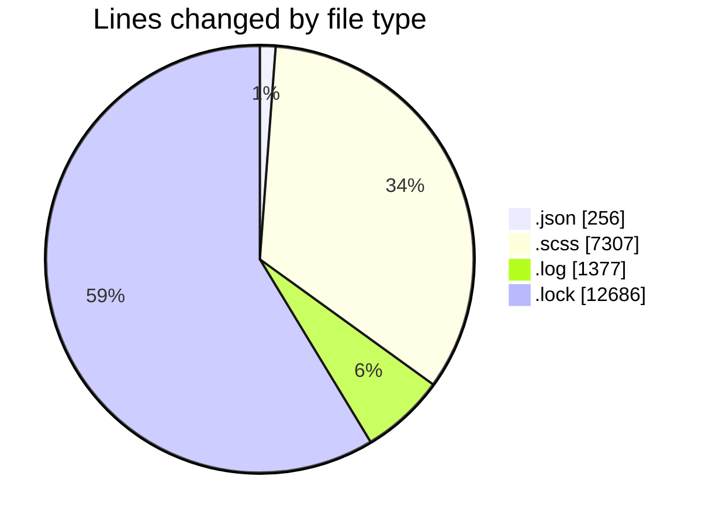
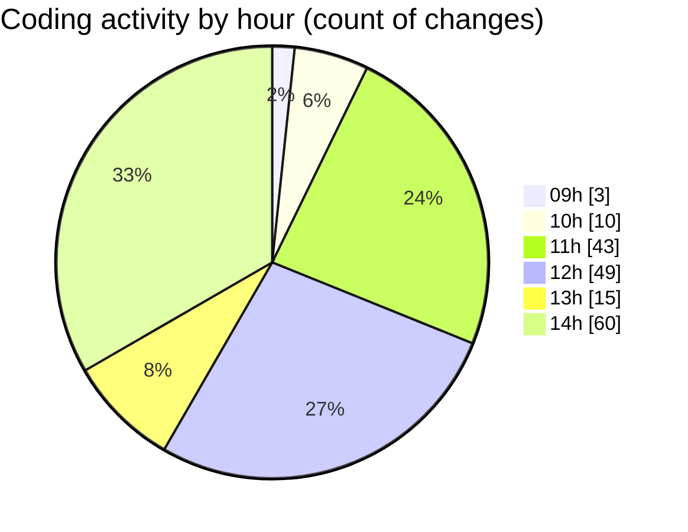

# cda - Activity Summary 

## Overall Statistics

| Stat                   | Value                                                             |
| ---------------------- | ----------------------------------------------------------------- |
| **Lines Added** (➕)   | 21350                                          |
| **Lines Removed** (➖) | 276                                        |
| **Net Change** (↕)    | 21074                |
| **Active Time** (⌚)   | 261 minutes |

## Modified Files
- **settings.json** (+71, -0)
- **_breakpoints.scss** (+17, -4)
- **_check.scss** (+136, -0)
- **_input-group.scss** (+214, -4)
- **_input.scss** (+280, -0)
- **_banner.scss** (+39, -0)
- **_button.scss** (+487, -5)
- **_button.scss** (+104, -2)
- **_close.scss** (+54, -1)
- **_forms.scss** (+87, -5)
- **_label.scss** (+72, -2)
- **_list-group.scss** (+151, -0)
- **_media.scss** (+91, -1)
- **_panel.scss** (+103, -0)
- **_table.scss** (+296, -1)
- **_grid.scss** (+27, -0)
- **_reset.scss** (+441, -0)
- **_type.scss** (+476, -38)
- **_background.scss** (+24, -3)
- **_banner.scss** (+31, -0)
- **_breakpoints.scss** (+136, -0)
- **_display.scss** (+77, -0)
- **_flex.scss** (+114, -0)
- **_screenreaders.scss** (+7, -0)
- **_spacing.scss** (+92, -2)
- **_text.scss** (+41, -0)
- **_colors.scss** (+146, -0)
- **_spacing.scss** (+13, -0)
- **_type.scss** (+26, -0)
- **_base.scss** (+36, -0)
- **_label.scss** (+22, -7)
- **package.json** (+182, -3)
- **debug-storybook.log** (+1377, -0)
- **yarn.lock** (+12686, -0)
- **accordion.scss** (+81, -4)
- **_index.scss** (+5, -0)
- **alert.scss** (+29, -0)
- **autocomplete.scss** (+84, -2)
- **autocompleteTag.scss** (+139, -4)
- **badge.scss** (+346, -1)
- **banner.scss** (+56, -4)
- **Breakout.scss** (+44, -1)
- **card.scss** (+120, -5)
- **filter.scss** (+55, -9)
- **footer.scss** (+146, -2)
- **header.scss** (+381, -4)
- **InputField.scss** (+255, -6)
- **link.scss** (+25, -0)
- **List.scss** (+57, -2)
- **modal.scss** (+205, -0)
- **MultiSelect.scss** (+135, -2)
- **pagination.scss** (+87, -6)
- **searchbar.scss** (+88, -14)
- **index.scss** (+60, -0)
- **statsBox.scss** (+225, -0)
- **tooltip.scss** (+46, -1)
- **usefulLinks.scss** (+104, -8)
- **FeedbackModal.scss** (+62, -0)
- **FeedbackTypeButton.scss** (+32, -0)
- **tabs.scss** (+90, -3)
- **datepicker.scss** (+237, -120)

## Visualizations

### By File Type (Lines Changed)

### By Hour (Estimated Activity Count)

> **Last Updated:** 22/01/2026, 14:56:07