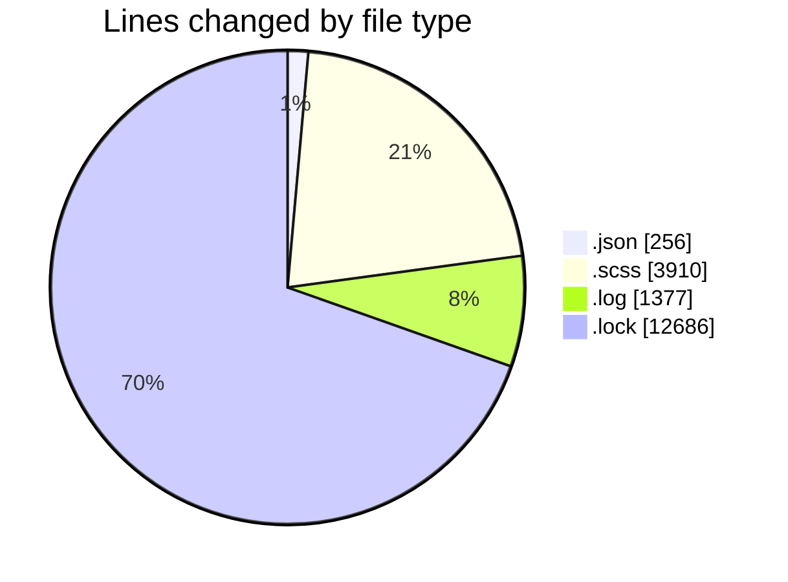
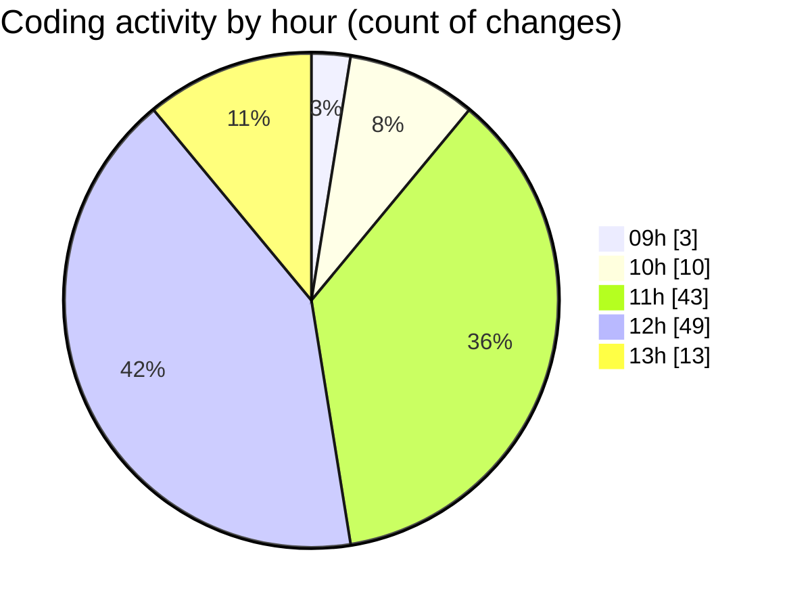

# cda - Activity Summary 

## Overall Statistics

| Stat                   | Value                                                             |
| ---------------------- | ----------------------------------------------------------------- |
| **Lines Added** (➕)   | 18153                                          |
| **Lines Removed** (➖) | 76                                        |
| **Net Change** (↕)    | 18077                |
| **Active Time** (⌚)   | 186 minutes |

## Modified Files
- **settings.json** (+71, -0)
- **_breakpoints.scss** (+17, -4)
- **_check.scss** (+136, -0)
- **_input-group.scss** (+214, -4)
- **_input.scss** (+280, -0)
- **_banner.scss** (+39, -0)
- **_button.scss** (+487, -5)
- **_button.scss** (+104, -2)
- **_close.scss** (+54, -1)
- **_forms.scss** (+87, -5)
- **_label.scss** (+72, -2)
- **_list-group.scss** (+151, -0)
- **_media.scss** (+91, -1)
- **_panel.scss** (+103, -0)
- **_table.scss** (+296, -1)
- **_grid.scss** (+27, -0)
- **_reset.scss** (+440, -0)
- **_type.scss** (+476, -36)
- **_background.scss** (+22, -3)
- **_banner.scss** (+31, -0)
- **_breakpoints.scss** (+136, -0)
- **_display.scss** (+77, -0)
- **_flex.scss** (+114, -0)
- **_screenreaders.scss** (+7, -0)
- **_spacing.scss** (+92, -2)
- **_text.scss** (+41, -0)
- **_colors.scss** (+146, -0)
- **_spacing.scss** (+13, -0)
- **_type.scss** (+26, -0)
- **_base.scss** (+36, -0)
- **_label.scss** (+22, -7)
- **package.json** (+182, -3)
- **debug-storybook.log** (+1377, -0)
- **yarn.lock** (+12686, -0)

## Visualizations

### By File Type (Lines Changed)

### By Hour (Estimated Activity Count)

> **Last Updated:** 22/01/2026, 13:46:07