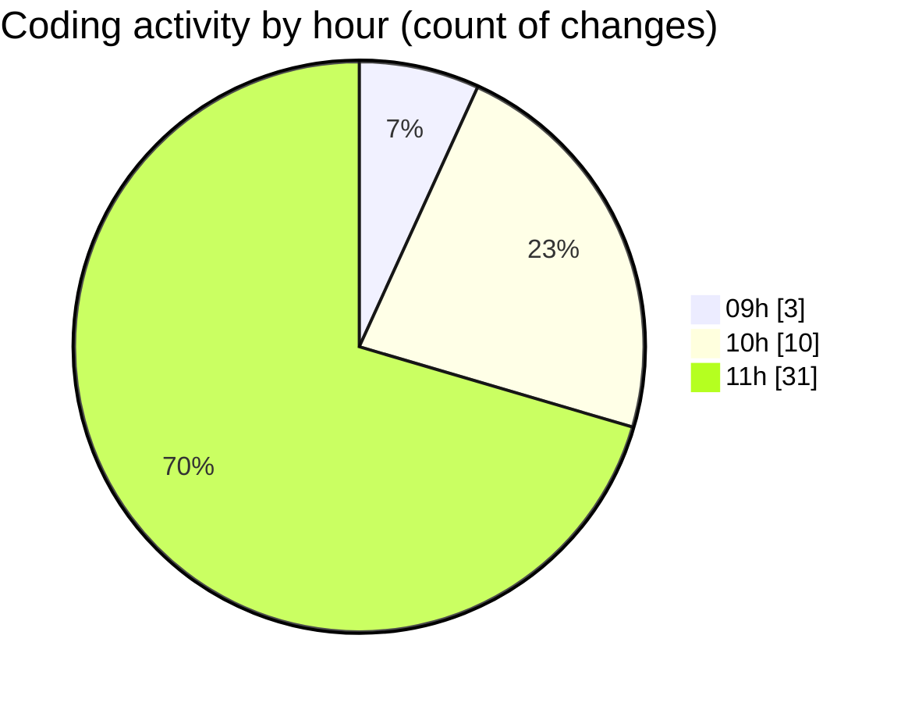

# cda - Activity Summary 

## Overall Statistics

| Stat                   | Value                                                             |
| ---------------------- | ----------------------------------------------------------------- |
| **Lines Added** (➕)   | 1883                                          |
| **Lines Removed** (➖) | 17                                        |
| **Net Change** (↕)    | 1866                |
| **Active Time** (⌚)   | 65 minutes |

## Modified Files
- **settings.json** (+71, -0)
- **_breakpoints.scss** (+17, -4)
- **_check.scss** (+136, -0)
- **_input-group.scss** (+212, -4)
- **_input.scss** (+277, -0)
- **_banner.scss** (+39, -0)
- **_button.scss** (+485, -5)
- **_button.scss** (+98, -0)
- **_close.scss** (+52, -0)
- **_forms.scss** (+87, -4)
- **_label.scss** (+70, -0)
- **_list-group.scss** (+151, -0)
- **_media.scss** (+88, -0)
- **_panel.scss** (+100, -0)

## Visualizations

### By File Type (Lines Changed)

### By Hour (Estimated Activity Count)

> **Last Updated:** 22/01/2026, 11:41:07