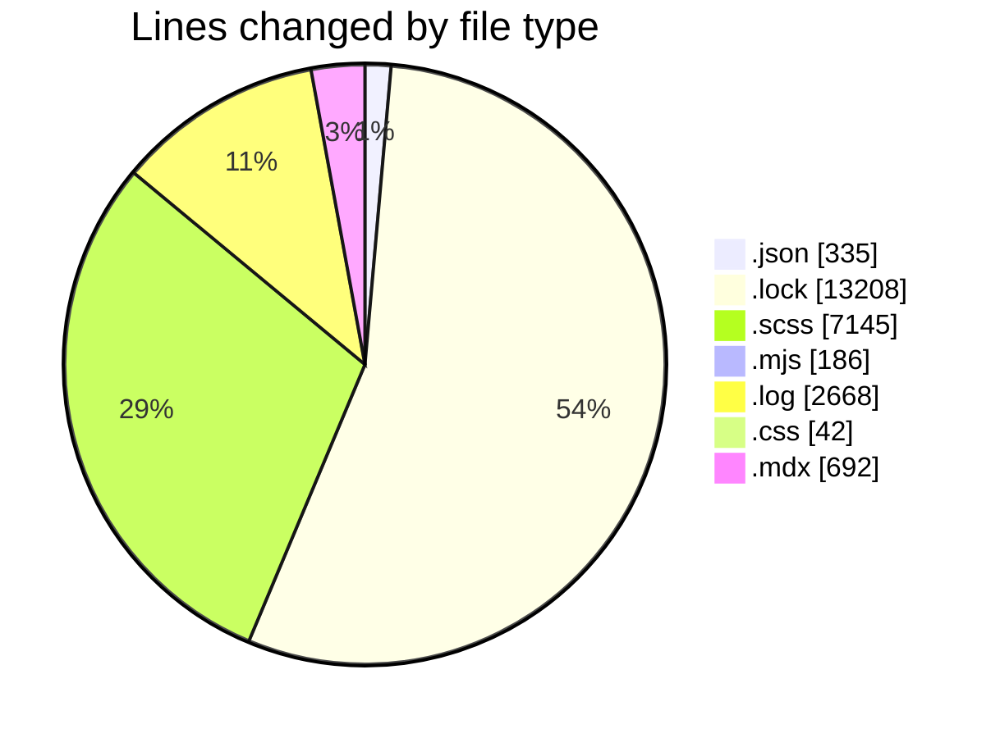
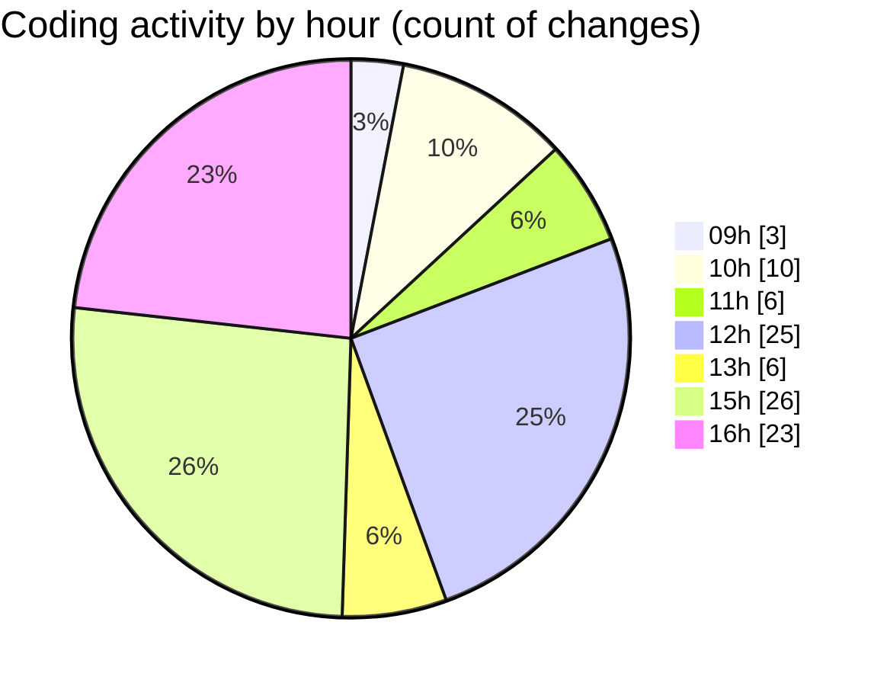

# cda - Activity Summary 

## Overall Statistics

| Stat                   | Value                                                             |
| ---------------------- | ----------------------------------------------------------------- |
| **Lines Added** (➕)   | 21503                                          |
| **Lines Removed** (➖) | 2773                                        |
| **Net Change** (↕)    | 18730                |
| **Active Time** (⌚)   | 135 minutes |

## Modified Files
- **package.json** (+181, -4)
- **package.json** (+85, -0)
- **yarn.lock** (+13208, -0)
- **_grid.scss** (+152, -66)
- **_grid.scss** (+34, -5)
- **package.json** (+65, -0)
- **rollup.config.mjs** (+165, -21)
- **_type.scss** (+2184, -1308)
- **_grid.scss** (+62, -33)
- **_type.scss** (+438, -0)
- **_base.scss** (+41, -3)
- **debug-storybook.log** (+1335, -1333)
- **bundle.css** (+42, -0)
- **usefulLinks.scss** (+96, -0)
- **_button.scss** (+482, -0)
- **footer.scss** (+144, -0)
- **header.scss** (+377, -0)
- **_media.scss** (+90, -0)
- **_type.scss** (+438, -0)
- **Utilities.mdx** (+692, -0)
- **_button.scss** (+964, -0)
- **_media.scss** (+180, -0)
- **_demo.scss** (+48, -0)

## Visualizations

### By File Type (Lines Changed)

### By Hour (Estimated Activity Count)

> **Last Updated:** 26/01/2026, 16:50:30