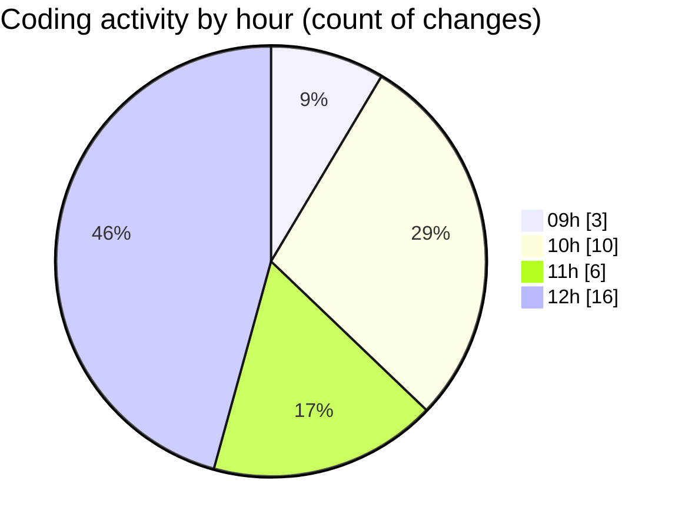

# cda - Activity Summary 

## Overall Statistics

| Stat                   | Value                                                             |
| ---------------------- | ----------------------------------------------------------------- |
| **Lines Added** (➕)   | 15959                                          |
| **Lines Removed** (➖) | 1382                                        |
| **Net Change** (↕)    | 14577                |
| **Active Time** (⌚)   | 44 minutes |

## Modified Files
- **package.json** (+178, -0)
- **package.json** (+85, -0)
- **yarn.lock** (+13208, -0)
- **_grid.scss** (+60, -31)
- **_grid.scss** (+32, -3)
- **package.json** (+65, -0)
- **rollup.config.mjs** (+85, -7)
- **_type.scss** (+1746, -1308)
- **_grid.scss** (+62, -33)
- **_type.scss** (+438, -0)

## Visualizations

### By File Type (Lines Changed)

### By Hour (Estimated Activity Count)

> **Last Updated:** 26/01/2026, 12:12:17